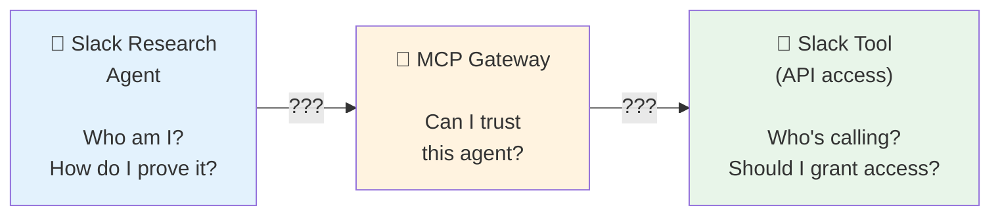
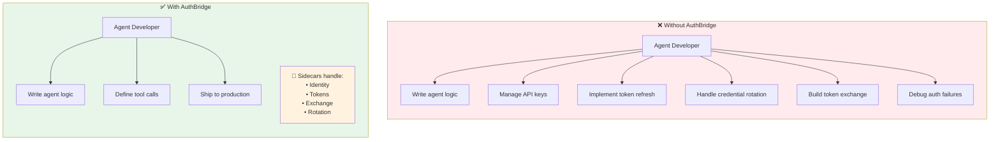
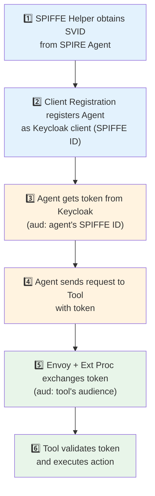
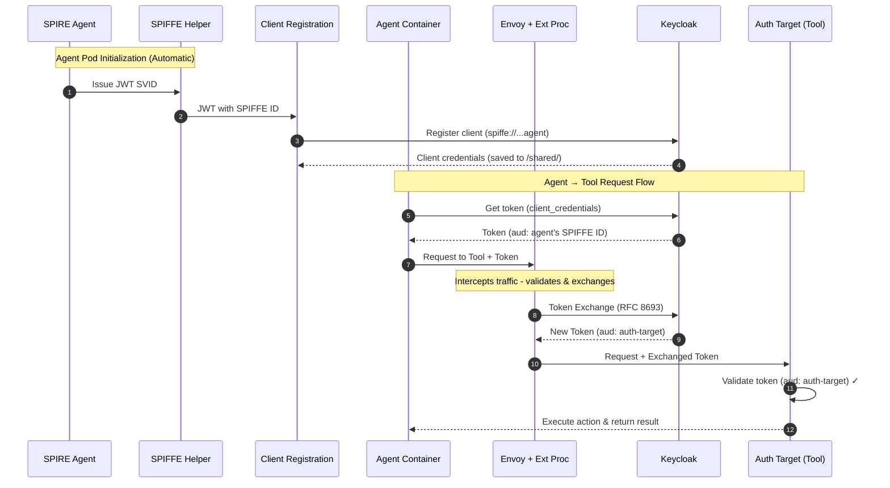
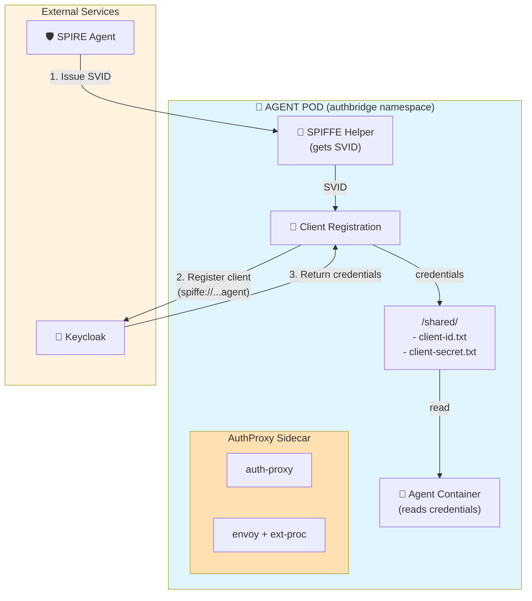
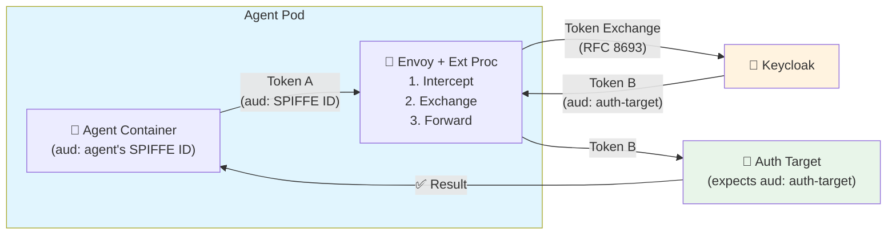
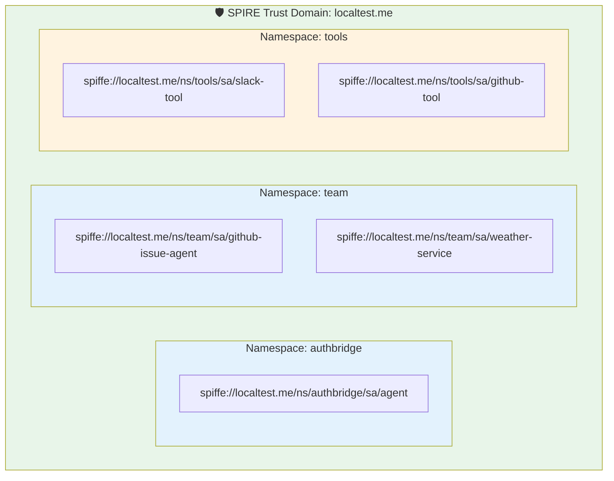
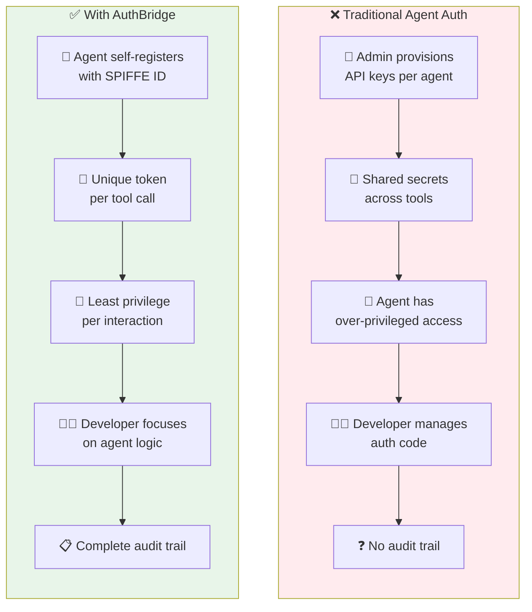
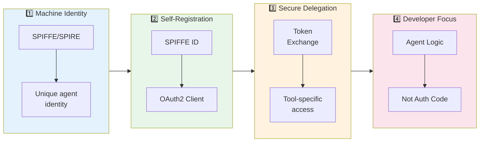

# AuthBridge: Securing Agent-to-Tool Communication in AI Agentic Platforms

*How Kagenti enables zero-trust authentication for AI agents—so developers can focus on building agents, not managing credentials*

---

## The Rise of AI Agents—And Their Security Challenge

AI agents are transforming how we build applications. Instead of monolithic services, modern AI systems are composed of autonomous **agents** that orchestrate calls to specialized **tools**—from Slack messaging to GitHub issue management to weather APIs.

But with this power comes a critical security challenge: **How do AI agents securely authenticate when calling tools?**

```
┌─────────────────┐         ┌──────────────────┐         ┌─────────────────┐
│  Slack Research │────────►│   MCP Gateway    │────────►│   Slack Tool    │
│     Agent       │         │   (validates?)   │         │   (API access)  │
│                 │         │                  │         │                 │
│   Who am I?     │         │   Can I trust    │         │   Who's calling │
│   How do I      │         │   this agent?    │         │   me? Should I  │
│   prove it?     │         │                  │         │   grant access? │
└─────────────────┘         └──────────────────┘         └─────────────────┘
```

<details>
<summary><b>📊 Mermaid Diagram</b></summary>



</details>

Traditional approaches—static API keys, shared secrets, long-lived tokens—create significant security risks in agentic systems:

- **Credential sprawl** - Each agent-tool combination needs separate credentials
- **Over-privileged tokens** - Agents often get more access than needed
- **No identity chain** - When a tool is called, it can't verify *which* agent made the request
- **Manual management** - Scaling to hundreds of agents becomes operationally impossible

---

## AuthBridge: Zero-Trust for Agentic Platforms

**AuthBridge** solves these challenges by bringing zero-trust principles to agent-tool communication. It's a core component of the [Kagenti Agentic Platform](https://github.com/kagenti/kagenti), providing:

| Capability | What It Means for Agents |
|------------|--------------------------|
| **Automatic Agent Identity** | Each agent automatically receives a cryptographic identity (SPIFFE ID) |
| **Self-Registration** | Agents register themselves as OAuth2 clients—no manual provisioning |
| **Transparent Token Exchange** | Agent tokens are automatically exchanged for tool-specific audiences |
| **Least Privilege** | Tools receive only the permissions the agent is authorized for |
| **Audit Trail** | Every agent-tool interaction is traceable through the identity chain |

---

## 🎯 Developer Experience: Focus on Your Agent, Not Identity

One of the most powerful aspects of AuthBridge is what it **removes** from an agent developer's concerns.

### The Problem for Developers

Without AuthBridge, agent developers must:

```
┌─────────────────────────────────────────────────────────────────────────────┐
│  Agent Developer's Security Burden (Without AuthBridge)                     │
│                                                                             │
│  ❌ Obtain and manage API keys for each tool                                │
│  ❌ Implement token refresh logic                                           │
│  ❌ Handle credential rotation                                              │
│  ❌ Build token exchange code for each target service                       │
│  ❌ Manage secrets securely (don't hardcode, use vaults, etc.)              │
│  ❌ Understand OAuth2/OIDC protocols                                        │
│  ❌ Debug authentication failures across multiple services                  │
└─────────────────────────────────────────────────────────────────────────────┘
```

### The AuthBridge Solution

With AuthBridge, all identity and authentication concerns are handled by **sidecars**—completely transparent to the agent code:

```
┌─────────────────────────────────────────────────────────────────────────────┐
│  Agent Developer's Focus (With AuthBridge)                                  │
│                                                                             │
│  ✅ Write agent logic and LLM interactions                                  │
│  ✅ Define which tools the agent needs to call                              │
│  ✅ Focus on business value, not plumbing                                   │
│                                                                             │
│  Identity? Handled by sidecars.                                             │
│  Token exchange? Handled by sidecars.                                       │
│  Credential rotation? Handled by sidecars.                                  │
│  Audience transformation? Handled by sidecars.                              │
└─────────────────────────────────────────────────────────────────────────────┘
```

<details>
<summary><b>📊 Mermaid Comparison Diagram</b></summary>



</details>

### What This Means in Practice

**Agent code WITHOUT AuthBridge:**
```python
# Developer must handle all of this 😰
class SlackAgent:
    def __init__(self):
        self.client_id = os.getenv("SLACK_CLIENT_ID")
        self.client_secret = os.getenv("SLACK_CLIENT_SECRET")
        self.token = None
        self.token_expiry = None
    
    def get_token(self):
        if self.token_expiry and time.time() < self.token_expiry:
            return self.token
        # Refresh token logic...
        response = requests.post(TOKEN_URL, data={...})
        self.token = response.json()["access_token"]
        self.token_expiry = time.time() + response.json()["expires_in"]
        return self.token
    
    def call_slack_tool(self, action):
        token = self.get_token()
        # Exchange token for Slack audience...
        exchanged_token = self.exchange_token(token, "slack-tool")
        return requests.get(SLACK_TOOL_URL, 
                          headers={"Authorization": f"Bearer {exchanged_token}"})
```

**Agent code WITH AuthBridge:**
```python
# Developer focuses on agent logic 😊
class SlackAgent:
    def call_slack_tool(self, action):
        # Just make the call - sidecars handle everything!
        return requests.get(SLACK_TOOL_URL, 
                          headers={"Authorization": f"Bearer {self.token}"})
```

The agent developer:
- **Doesn't need to know** how tokens are obtained
- **Doesn't need to implement** token refresh
- **Doesn't need to understand** audience transformation
- **Doesn't need to manage** credentials

All of this is handled automatically by the AuthBridge sidecars.

---

## The Agentic Architecture

In the Kagenti platform, the authorization pattern enables:

- **Machine Identity Management** – replacing static credentials with SPIRE-issued JWTs
- **Secure Delegation** – enforcing token exchange to propagate identity across services
- **Continuous Verification** – ensuring authentication and authorization at each step

### Agent-Tool Communication Flow

```
┌─────────────────────────────────────────────────────────────────────────────────────────┐
│  1. SPIFFE Helper obtains SVID from SPIRE Agent for the Agent workload                  │
│  2. Client Registration registers Agent as Keycloak client using SPIFFE ID              │
│  3. Agent gets token from Keycloak (aud: agent's SPIFFE ID via agent-spiffe-aud scope)  │
│  4. Agent sends request to Tool with token                                              │
│  5. Envoy + Ext Proc intercepts, exchanges token (aud: tool's expected audience)        │
│  6. Tool validates token and executes the requested action                              │
└─────────────────────────────────────────────────────────────────────────────────────────┘
```

<details>
<summary><b>📊 Mermaid Flowchart (Steps)</b></summary>



</details>

<details>
<summary><b>📊 Mermaid Sequence Diagram (Detailed)</b></summary>



</details>

---

## How AuthBridge Works in Kagenti

### Component 1: Client Registration for Agents

When an agent pod starts, it automatically registers itself with Keycloak using its **SPIFFE ID** as the client identifier:

```
SPIFFE ID Format:
spiffe://{trust-domain}/ns/{namespace}/sa/{service-account}

Examples:
spiffe://localtest.me/ns/authbridge/sa/agent
spiffe://localtest.me/ns/team/sa/github-issue-agent
spiffe://localtest.me/ns/team/sa/weather-service
```

```
┌─────────────────────────────────────────────────────────────────────────────┐
│                           AGENT POD                                         │
│  ┌─────────────┐  ┌─────────────┐  ┌─────────────────────────────────────┐  │
│  │   spiffe-   │  │   client-   │  │          AuthProxy Sidecar          │  │
│  │   helper    │─►│registration │  │  ┌───────────┐  ┌────────────────┐  │  │
│  │  (gets SVID)│  │(Keycloak)   │  │  │auth-proxy │  │envoy + ext-proc│  │  │
│  └─────────────┘  └──────┬──────┘  │  └───────────┘  └────────────────┘  │  │
│                          │         └─────────────────────────────────────┘  │
│                          ▼                                                  │
│               ┌─────────────────────┐                                       │
│               │  /shared/ directory │                                       │
│               │  - client-id.txt    │◄── Agent container reads credentials  │
│               │  - client-secret.txt│                                       │
│               └─────────────────────┘                                       │
└─────────────────────────────────────────────────────────────────────────────┘
                                   │
                    ┌──────────────▼──────────────┐
                    │         Keycloak            │
                    │                             │
                    │  Client ID: spiffe://       │
                    │    localtest.me/ns/         │
                    │    authbridge/sa/agent      │
                    └─────────────────────────────┘
```

<details>
<summary><b>📊 Mermaid Diagram</b></summary>



</details>

**Benefits for Agents:**
- ✅ **No pre-provisioned credentials** - Agents self-register at startup
- ✅ **Unique identity per agent instance** - Each pod gets its own SPIFFE ID
- ✅ **Automatic credential rotation** - SVIDs are short-lived and auto-renewed
- ✅ **Auditable** - Every agent is traceable through its SPIFFE ID

### Component 2: AuthProxy for Tool Access

When an agent calls a tool, the AuthProxy sidecar (Envoy + Ext Proc) transparently exchanges the agent's token for one the tool will accept:

```
┌─────────────────┐               ┌────────────────────────┐              ┌─────────────────┐
│     Agent       │ ── Token A ──►│    Envoy + Ext Proc    │── Token B ──►│   Auth Target   │ ✅
│   Container     │               │  1. Intercept request  │              │    (Tool)       │
│                 │               │  2. Exchange token     │              │                 │
│ Token:          │               │  3. Forward request    │              │ (expects        │
│ (aud: agent's   │               │                        │              │  aud: auth-     │
│  SPIFFE ID)     │               │                        │              │  target)        │
└─────────────────┘               └────────────────────────┘              └─────────────────┘
                                            │
                                            ▼ Token Exchange (RFC 8693)
                                   ┌─────────────────┐
                                   │    Keycloak     │
                                   └─────────────────┘
```

<details>
<summary><b>📊 Mermaid Diagram</b></summary>



</details>

**Benefits for Tool Access:**
- ✅ **Transparent to agents** - Agent code doesn't know about token exchange
- ✅ **Proper audience scoping** - Each tool receives tokens specifically for it
- ✅ **Least privilege** - Agents can only access tools they're authorized for
- ✅ **Standards-based** - Uses OAuth 2.0 Token Exchange (RFC 8693)

---

## Security Properties for Agentic Systems

AuthBridge provides critical security guarantees for AI agent deployments:

### 🤖 Machine Identity Management

Every agent gets a unique, cryptographic identity—no more shared API keys:

```bash
# Each agent has a unique SPIFFE ID
spiffe://localtest.me/ns/authbridge/sa/agent
spiffe://localtest.me/ns/team/sa/github-issue-agent
spiffe://localtest.me/ns/team/sa/weather-service
```

<details>
<summary><b>📊 Mermaid Identity Diagram</b></summary>



</details>

### 🔒 Secure Delegation

Token exchange enforces that agents can only access tools they're authorized for:

```
Agent Token (limited scope) → Exchange → Tool Token (tool-specific)
```

The tool never sees the agent's original credentials—only a purpose-limited token.

### 🔍 Continuous Verification

Every step in the agent-tool chain is verified:

1. **SPIRE verifies** the agent workload's identity
2. **Keycloak verifies** the agent's credentials during token request
3. **Envoy validates** the agent's token before exchange
4. **Keycloak verifies** the exchange is authorized
5. **Tool verifies** the exchanged token before execution

```mermaid
flowchart LR
    subgraph K8s["☸️ Kubernetes"]
        Pod["🤖 Agent Pod"]
    end
    
    subgraph SPIRE["🛡️ SPIRE"]
        Attest["Workload<br/>Attestation"]
        SVID["SPIFFE ID"]
    end
    
    subgraph Keycloak["🔑 Keycloak"]
        Client["OAuth2 Client"]
        Token["JWT Token"]
        Exchange["Token<br/>Exchange"]
    end
    
    subgraph Tool["🔧 Tool"]
        Validate["Validate<br/>Token"]
        Execute["Execute<br/>Action"]
    end
    
    Pod -->|"1. Attest"| Attest
    Attest -->|"2. Issue"| SVID
    SVID -->|"3. Register"| Client
    Client -->|"4. Authenticate"| Token
    Token -->|"5. Exchange"| Exchange
    Exchange -->|"6. Present"| Validate
    Validate --> Execute
    
    style K8s fill:#e3f2fd
    style SPIRE fill:#e8f5e9
    style Keycloak fill:#fff3e0
    style Tool fill:#fce4ec
```

<details>
<summary><b>📊 Mermaid Trust Chain Diagram</b></summary>



</details>

### 📋 Complete Audit Trail

Every agent-tool interaction is traceable:

```json
{
  "timestamp": "2026-01-13T10:30:00Z",
  "agent": "spiffe://localtest.me/ns/authbridge/sa/agent",
  "tool": "auth-target",
  "action": "GET /test",
  "result": "authorized",
  "token_claims": {
    "original_aud": "spiffe://localtest.me/ns/authbridge/sa/agent",
    "exchanged_aud": "auth-target",
    "azp": "spiffe://localtest.me/ns/authbridge/sa/agent"
  }
}
```

---

## Running the AuthBridge Demo

Ready to see AuthBridge in action with agents and tools?

### Prerequisites

- **Kagenti Platform** installed ([installation guide](https://github.com/kagenti/kagenti/blob/main/docs/install.md))
- **SPIRE** running (included in Kagenti)
- **Keycloak** deployed (included in Kagenti)

### Quick Start

#### 1. Build AuthProxy Images

```bash
cd AuthBridge/AuthProxy
make build-images
make load-images
```

#### 2. Configure Keycloak

```bash
# Port-forward Keycloak
kubectl port-forward service/keycloak-service -n keycloak 8080:8080

# Run setup script (in a new terminal)
cd AuthBridge
python -m venv venv && source venv/bin/activate
pip install -r requirements.txt
python setup_keycloak.py
```

The setup script creates:
- `demo` realm
- `auth-target` client (token exchange target)
- `agent-spiffe-aud` scope (realm default - adds Agent's SPIFFE ID to all tokens)
- `auth-target-aud` scope (for exchanged tokens)

#### 3. Deploy the Demo

```bash
# With SPIFFE (recommended for agentic use)
kubectl apply -f k8s/authbridge-deployment.yaml

# Wait for pods to be ready
kubectl wait --for=condition=available --timeout=180s deployment/agent -n authbridge
kubectl wait --for=condition=available --timeout=120s deployment/auth-target -n authbridge
```

#### 4. Test Agent → Tool Flow

```bash
kubectl exec deployment/agent -n authbridge -c agent -- sh -c '
# Agent credentials (auto-populated by sidecars!)
CLIENT_ID=$(cat /shared/client-id.txt)
CLIENT_SECRET=$(cat /shared/client-secret.txt)

echo "Agent SPIFFE ID: $CLIENT_ID"

# Get agent token
TOKEN=$(curl -s http://keycloak-service.keycloak.svc:8080/realms/demo/protocol/openid-connect/token \
  -d "grant_type=client_credentials" \
  -d "client_id=$CLIENT_ID" \
  -d "client_secret=$CLIENT_SECRET" | jq -r ".access_token")

echo ""
echo "Agent token audience (before exchange):"
echo $TOKEN | cut -d. -f2 | tr "_-" "/+" | { read p; echo "${p}=="; } | base64 -d | jq -r "{aud, azp, scope}"

echo ""
echo "Calling auth-target (token exchange happens transparently)..."
curl -H "Authorization: Bearer $TOKEN" http://auth-target-service:8081/test
'
```

**Expected Output:**
```
Agent SPIFFE ID: spiffe://localtest.me/ns/authbridge/sa/agent

Agent token audience (before exchange):
{
  "aud": "spiffe://localtest.me/ns/authbridge/sa/agent",
  "azp": "spiffe://localtest.me/ns/authbridge/sa/agent",
  "scope": "agent-spiffe-aud profile email"
}

Calling auth-target (token exchange happens transparently)...
authorized
```

#### 5. Inspect Token Claims (Before and After Exchange)

```bash
# View original token (before exchange)
kubectl exec deployment/agent -n authbridge -c agent -- sh -c '
CLIENT_ID=$(cat /shared/client-id.txt)
CLIENT_SECRET=$(cat /shared/client-secret.txt)
TOKEN=$(curl -s http://keycloak-service.keycloak.svc:8080/realms/demo/protocol/openid-connect/token \
  -d "grant_type=client_credentials" \
  -d "client_id=$CLIENT_ID" \
  -d "client_secret=$CLIENT_SECRET" | jq -r ".access_token")

echo "╔══════════════════════════════════════════════════════════════╗"
echo "║           ORIGINAL TOKEN (Before Exchange)                   ║"
echo "╚══════════════════════════════════════════════════════════════╝"
echo $TOKEN | cut -d"." -f2 | tr "_-" "/+" | { read p; echo "${p}=="; } | base64 -d | jq "{aud, azp, scope, iss}"

echo ""
echo "Calling auth-target..."
curl -s -H "Authorization: Bearer $TOKEN" http://auth-target-service:8081/test
'

# View exchanged token from logs
echo ""
echo "╔══════════════════════════════════════════════════════════════╗"
echo "║           EXCHANGED TOKEN (After Exchange)                   ║"
echo "╚══════════════════════════════════════════════════════════════╝"
kubectl logs deployment/auth-target -n authbridge | grep -A 5 "JWT Debug"
```

**Token Claims Summary:**

| Claim | Before Exchange | After Exchange |
|-------|-----------------|----------------|
| `aud` | Agent's SPIFFE ID | `auth-target` |
| `azp` | Agent's SPIFFE ID | Agent's SPIFFE ID |
| `scope` | `agent-spiffe-aud profile email` | `openid auth-target-aud` |
| `iss` | Keycloak realm | Keycloak realm (same) |

---

## Comparison: Traditional vs AuthBridge for Agents

| Aspect | Traditional Approach | With AuthBridge |
|--------|----------------------|-----------------|
| **Agent Identity** | Static API keys per agent | SPIFFE ID (cryptographic) |
| **Credential Management** | Manual provisioning | Self-registration at startup |
| **Tool Access** | Shared credentials | Token exchange per tool |
| **Privilege Scope** | Often over-privileged | Least privilege per call |
| **Audit Trail** | Limited visibility | Full identity chain |
| **Credential Rotation** | Manual, error-prone | Automatic (short-lived SVIDs) |
| **Scaling** | Operational burden | Automatic with pod lifecycle |
| **Developer Burden** | Must handle auth logic | Focus on agent logic only |

<details>
<summary><b>📊 Mermaid Comparison Diagram</b></summary>



</details>

---

## Demo Architecture Overview

The AuthBridge demo deploys the following components:

```
┌─────────────────────────────────────────────────────────────────────────────┐
│                              KUBERNETES CLUSTER                             │
│                                                                             │
│  ┌─────────────────────────────────────────────────────────────────────┐    │
│  │                    AGENT POD (namespace: authbridge)                │    │
│  │                                                                     │    │
│  │  ┌─────────────┐  ┌─────────────┐  ┌──────────────────────────────┐ │    │
│  │  │    agent    │  │   spiffe-   │  │      client-registration     │ │    │
│  │  │ (netshoot)  │  │   helper    │  │  (registers with Keycloak)   │ │    │
│  │  └─────────────┘  └─────────────┘  └──────────────────────────────┘ │    │
│  │                                                                     │    │
│  │  ┌───────────────────────────────────────────────────────────────┐  │    │
│  │  │                    AuthProxy Sidecar                          │  │    │
│  │  │  ┌────────────┐  ┌──────────────┐  ┌────────────────────────┐ │  │    │
│  │  │  │ auth-proxy │  │ envoy-proxy  │  │       ext-proc         │ │  │    │
│  │  │  │  (8080)    │  │   (15123)    │  │  (token exchange)      │ │  │    │
│  │  │  └────────────┘  └──────────────┘  └────────────────────────┘ │  │    │
│  │  └───────────────────────────────────────────────────────────────┘  │    │
│  └─────────────────────────────────────────────────────────────────────┘    │
│                                      │                                      │
│                                      ▼                                      │
│  ┌─────────────────────────────────────────────────────────────────────┐    │
│  │                 AUTH-TARGET POD (namespace: authbridge)             │    │
│  │                                                                     │    │
│  │  ┌─────────────────────────────────────────────────────────────┐    │    │
│  │  │                      auth-target (8081)                     │    │    │
│  │  │               Validates tokens with aud: auth-target        │    │    │
│  │  └─────────────────────────────────────────────────────────────┘    │    │
│  └─────────────────────────────────────────────────────────────────────┘    │
│                                                                             │
├─────────────────────────────────────────────────────────────────────────────┤
│                            EXTERNAL SERVICES                                │
│                                                                             │
│  ┌──────────────────────┐          ┌──────────────────────┐                 │
│  │   SPIRE (namespace:  │          │ KEYCLOAK (namespace: │                 │
│  │       spire)         │          │     keycloak)        │                 │
│  │                      │          │                      │                 │
│  │  Provides SPIFFE     │          │  - demo realm        │                 │
│  │  identities (SVIDs)  │          │  - token exchange    │                 │
│  └──────────────────────┘          └──────────────────────┘                 │
└─────────────────────────────────────────────────────────────────────────────┘
```

---

## Conclusion

In the age of AI agents, security can't be an afterthought—but it also shouldn't be a developer's burden. AuthBridge brings zero-trust principles to agent-tool communication while keeping the complexity hidden from agent developers:

1. **Machine Identity** - Agents get cryptographic identities from SPIFFE/SPIRE
2. **Self-Registration** - Agents register as OAuth2 clients automatically
3. **Secure Delegation** - Token exchange ensures least-privilege access to tools
4. **Continuous Verification** - Every step in the chain is authenticated
5. **Developer Freedom** - Agent developers focus on building agents, not managing credentials

<details>
<summary><b>📊 Mermaid Summary Diagram</b></summary>



</details>

The result: AI agents can securely access tools without static credentials, over-privileged tokens, or manual credential management—and agent developers can focus on what they do best: **building intelligent agents**.

---

## Resources

- **[AuthBridge Demo Guide](./demo.md)** - Complete step-by-step demo instructions
- **[AuthBridge README](./README.md)** - Architecture overview and component documentation
- **[AuthProxy Documentation](./AuthProxy/README.md)** - Token validation and exchange proxy
- **[Client Registration](./client-registration/README.md)** - Automatic Keycloak client registration with SPIFFE
- **[Kagenti Installation](https://github.com/kagenti/kagenti/blob/main/docs/install.md)** - Platform setup guide
- **[SPIFFE/SPIRE Documentation](https://spiffe.io/docs/latest/)** - Workload identity framework
- **[OAuth 2.0 Token Exchange (RFC 8693)](https://datatracker.ietf.org/doc/html/rfc8693)** - Token exchange standard

---

*AuthBridge is part of the [Kagenti Agentic Platform](https://github.com/kagenti/kagenti), providing zero-trust identity and authorization infrastructure for AI agents—so developers can focus on building agents, not managing credentials.*
