# AuthBridge: Securing Agent-to-Tool Communication in AI Agentic Platforms

*How Kagenti enables zero-trust authentication for AI agents accessing external tools and services*

---

## The Rise of AI Agents—And Their Security Challenge

AI agents are transforming how we build applications. Instead of monolithic services, modern AI systems are composed of autonomous **agents** that orchestrate calls to specialized **tools**—from Slack messaging to GitHub issue management to weather APIs.

But with this power comes a critical security challenge: **How do AI agents securely authenticate when calling tools?**

```
┌─────────────────┐         ┌──────────────────┐         ┌─────────────────┐
│  Slack Research │────────►│   MCP Gateway    │────────►│   Slack Tool    │
│     Agent       │         │   (validates?)   │         │   (API access)  │
│                 │         │                  │         │                 │
│   Who am I?     │         │   Can I trust    │         │   Who's calling │
│   How do I      │         │   this agent?    │         │   me? Should I  │
│   prove it?     │         │                  │         │   grant access? │
└─────────────────┘         └──────────────────┘         └─────────────────┘
```

<details>
<summary><b>📊 Mermaid Diagram</b></summary>

```mermaid
flowchart LR
    Agent["🤖 Slack Research<br/>Agent<br/><br/>Who am I?<br/>How do I prove it?"]
    Gateway["🚪 MCP Gateway<br/><br/>Can I trust<br/>this agent?"]
    Tool["🔧 Slack Tool<br/>(API access)<br/><br/>Who's calling?<br/>Should I grant access?"]
    
    Agent -->|"???"| Gateway -->|"???"| Tool
    
    style Agent fill:#e3f2fd
    style Gateway fill:#fff3e0
    style Tool fill:#e8f5e9
```

</details>

Traditional approaches—static API keys, shared secrets, long-lived tokens—create significant security risks in agentic systems:

- **Credential sprawl** - Each agent-tool combination needs separate credentials
- **Over-privileged tokens** - Agents often get more access than needed
- **No identity chain** - When a tool is called, it can't verify *which* agent made the request
- **Manual management** - Scaling to hundreds of agents becomes operationally impossible

---

## AuthBridge: Zero-Trust for Agentic Platforms

**AuthBridge** solves these challenges by bringing zero-trust principles to agent-tool communication. It's a core component of the [Kagenti Agentic Platform](https://github.com/kagenti/kagenti), providing:

| Capability | What It Means for Agents |
|------------|--------------------------|
| **Automatic Agent Identity** | Each agent automatically receives a cryptographic identity (SPIFFE ID) |
| **Self-Registration** | Agents register themselves as OAuth2 clients—no manual provisioning |
| **Transparent Token Exchange** | Agent tokens are automatically exchanged for tool-specific audiences |
| **Least Privilege** | Tools receive only the permissions the agent is authorized for |
| **Audit Trail** | Every agent-tool interaction is traceable through the identity chain |

---

## The Agentic Architecture

In the Kagenti platform, the authorization pattern enables:

- **Machine Identity Management** – replacing static credentials with SPIRE-issued JWTs
- **Secure Delegation** – enforcing token exchange to propagate identity across services
- **Continuous Verification** – ensuring authentication and authorization at each step

### Agent-Tool Communication Flow

```
┌─────────────────────────────────────────────────────────────────────────────────────────┐
│  1. SPIFFE Helper obtains SVID from SPIRE Agent for the Agent workload                  │
│  2. Client Registration registers Agent as Keycloak client using SPIFFE ID              │
│  3. Agent gets token from Keycloak (aud: agent's SPIFFE ID)                             │
│  4. Agent sends request to Tool with token                                              │
│  5. AuthProxy intercepts, exchanges token (aud: tool's expected audience)               │
│  6. Tool validates token and executes the requested action                              │
└─────────────────────────────────────────────────────────────────────────────────────────┘
```

<details>
<summary><b>📊 Mermaid Flowchart (Steps)</b></summary>

```mermaid
flowchart TB
    Step1["1️⃣ SPIFFE Helper obtains SVID<br/>from SPIRE Agent"]
    Step2["2️⃣ Client Registration registers Agent<br/>as Keycloak client (SPIFFE ID)"]
    Step3["3️⃣ Agent gets token from Keycloak<br/>(aud: agent's SPIFFE ID)"]
    Step4["4️⃣ Agent sends request to Tool<br/>with token"]
    Step5["5️⃣ AuthProxy exchanges token<br/>(aud: tool's audience)"]
    Step6["6️⃣ Tool validates token<br/>and executes action"]
    
    Step1 --> Step2 --> Step3 --> Step4 --> Step5 --> Step6
    
    style Step1 fill:#e3f2fd
    style Step2 fill:#e3f2fd
    style Step3 fill:#fff3e0
    style Step4 fill:#fff3e0
    style Step5 fill:#e8f5e9
    style Step6 fill:#e8f5e9
```

</details>

<details>
<summary><b>📊 Mermaid Sequence Diagram (Detailed)</b></summary>

```mermaid
sequenceDiagram
    autonumber
    participant SPIRE as SPIRE Agent
    participant Helper as SPIFFE Helper
    participant Reg as Client Registration
    participant Agent as Slack Research Agent
    participant Proxy as AuthProxy (Envoy)
    participant KC as Keycloak
    participant Tool as Slack Tool

    Note over Helper,SPIRE: Agent Pod Initialization
    SPIRE->>Helper: Issue JWT SVID
    Helper->>Reg: JWT with SPIFFE ID
    Reg->>KC: Register client (spiffe://...slack-researcher)
    KC-->>Reg: Client credentials

    Note over Agent,Tool: Agent → Tool Request Flow
    Agent->>KC: Get token (client_credentials)
    KC-->>Agent: Token (aud: agent's SPIFFE ID)
    
    Agent->>Proxy: Request to Slack Tool + Token
    Note over Proxy: Transparent proxy - validates & exchanges
    
    Proxy->>KC: Token Exchange (RFC 8693)
    KC-->>Proxy: New Token (aud: slack-tool)
    
    Proxy->>Tool: Request + Exchanged Token
    Tool->>Tool: Validate token (aud: slack-tool) ✓
    Tool-->>Agent: Execute action & return result
```

</details>

---

## How AuthBridge Works in Kagenti

### Component 1: Client Registration for Agents

When an agent pod starts, it automatically registers itself with Keycloak using its **SPIFFE ID** as the client identifier:

```
SPIFFE ID Format:
spiffe://{trust-domain}/ns/{namespace}/sa/{service-account}

Examples:
spiffe://localtest.me/ns/team/sa/slack-researcher
spiffe://localtest.me/ns/team/sa/github-issue-agent
spiffe://localtest.me/ns/team/sa/weather-service
```

```
┌─────────────────────────────────────────────────────────────────────┐
│                      AGENT POD                                      │
│  ┌─────────────────┐    ┌─────────────────┐    ┌─────────────────┐  │
│  │  SPIFFE Helper  │───►│ Client          │───►│  Agent Logic    │  │
│  │  (gets SVID)    │    │ Registration    │    │  (uses creds)   │  │
│  └─────────────────┘    └────────┬────────┘    └─────────────────┘  │
└──────────────────────────────────┼──────────────────────────────────┘
                                   │
                    ┌──────────────▼──────────────┐
                    │         Keycloak            │
                    │                             │
                    │  Client ID: spiffe://       │
                    │    localtest.me/ns/team/    │
                    │    sa/slack-researcher      │
                    └─────────────────────────────┘
```

<details>
<summary><b>📊 Mermaid Diagram</b></summary>

```mermaid
flowchart TB
    subgraph AgentPod["🤖 AGENT POD (slack-researcher)"]
        Helper["🔐 SPIFFE Helper<br/>(gets SVID)"]
        Reg["📝 Client Registration"]
        Agent["🧠 Agent Logic<br/>(LLM + tools)"]
        
        Helper -->|"SVID"| Reg
        Reg -->|"credentials"| Agent
    end
    
    subgraph External["External Services"]
        SPIRE["🛡️ SPIRE Agent"]
        KC["🔑 Keycloak"]
    end
    
    SPIRE -->|"1. Issue SVID"| Helper
    Reg -->|"2. Register client<br/>(spiffe://...slack-researcher)"| KC
    KC -->|"3. Return credentials"| Reg
    
    style AgentPod fill:#e1f5fe
    style External fill:#fff3e0
```

</details>

**Benefits for Agents:**
- ✅ **No pre-provisioned credentials** - Agents self-register at startup
- ✅ **Unique identity per agent instance** - Each pod gets its own SPIFFE ID
- ✅ **Automatic credential rotation** - SVIDs are short-lived and auto-renewed
- ✅ **Auditable** - Every agent is traceable through its SPIFFE ID

### Component 2: AuthProxy for Tool Access

When an agent calls a tool, the AuthProxy sidecar transparently exchanges the agent's token for one the tool will accept:

```
┌─────────────────┐               ┌────────────────────────┐              ┌─────────────────┐
│ Slack Research  │ ── Token A ──►│      AuthProxy         │── Token B ──►│   Slack Tool    │ ✅
│    Agent        │               │  1. Validate agent     │              │                 │
│                 │               │  2. Exchange for tool  │              │ (expects        │
│ Token:          │               │  3. Forward request    │              │  aud: slack-tool│
│ (aud: agent)    │               │                        │              │                 │
└─────────────────┘               └────────────────────────┘              └─────────────────┘
                                            │
                                            ▼ Token Exchange (RFC 8693)
                                   ┌─────────────────┐
                                   │    Keycloak     │
                                   └─────────────────┘
```

<details>
<summary><b>📊 Mermaid Diagram</b></summary>

```mermaid
flowchart LR
    subgraph AgentPod["Agent Pod"]
        Agent["🤖 Slack Research<br/>Agent<br/>(aud: agent)"]
        Proxy["🔄 AuthProxy<br/>1. Validate<br/>2. Exchange<br/>3. Forward"]
    end
    
    KC["🔑 Keycloak"]
    Tool["🔧 Slack Tool<br/>(expects aud: slack-tool)"]
    
    Agent -->|"Token A<br/>(aud: agent)"| Proxy
    Proxy -->|"Token Exchange<br/>(RFC 8693)"| KC
    KC -->|"Token B<br/>(aud: slack-tool)"| Proxy
    Proxy -->|"Token B"| Tool
    Tool -->|"✅ Result"| Agent
    
    style AgentPod fill:#e1f5fe
    style Tool fill:#e8f5e9
    style KC fill:#fff3e0
```

</details>

**Benefits for Tool Access:**
- ✅ **Transparent to agents** - Agent code doesn't know about token exchange
- ✅ **Proper audience scoping** - Each tool receives tokens specifically for it
- ✅ **Least privilege** - Agents can only access tools they're authorized for
- ✅ **Standards-based** - Uses OAuth 2.0 Token Exchange (RFC 8693)

---

## Real-World Example: Slack Research Agent

Let's walk through a concrete example of how the Slack Research Agent accesses the Slack Tool:

### Architecture

```
┌────────────────────────────────────────────────────────────────────────┐
│                    SLACK RESEARCH AGENT POD                            │
│                    (ns: team, sa: slack-researcher)                    │
│                                                                        │
│  ┌─────────────────────────────────────────────────────────────────┐   │
│  │                      Containers                                 │   │
│  │  ┌──────────────┐  ┌─────────────────┐  ┌────────────────────┐  │   │
│  │  │   Agent      │  │  SPIFFE Helper  │  │    AuthProxy +     │  │   │
│  │  │  (LLM logic) │  │  (identity)     │  │    Envoy + Go Proc │  │   │
│  │  └──────────────┘  └─────────────────┘  └────────────────────┘  │   │
│  │                                                                 │   │
│  │  ┌──────────────────────────────────────────────────────────┐   │   │
│  │  │ client-registration                                      │   │   │
│  │  │ (registers: spiffe://localtest.me/ns/team/sa/slack-...)  │   │   │
│  │  └──────────────────────────────────────────────────────────┘   │   │
│  └─────────────────────────────────────────────────────────────────┘   │
│                              │                                         │
└──────────────────────────────┼─────────────────────────────────────────┘
                               │ Token exchanged for slack-tool audience
                               ▼
                    ┌─────────────────────┐
                    │   SLACK TOOL POD    │
                    │   (ns: team,        │
                    │    sa: slack-tool)  │
                    │                     │
                    │  Validates token    │
                    │  aud: slack-tool    │
                    │  Calls Slack API    │
                    └─────────────────────┘
```

<details>
<summary><b>📊 Mermaid Architecture Diagram</b></summary>

```mermaid
flowchart TB
    subgraph AgentPod["🤖 SLACK RESEARCH AGENT POD<br/>(ns: team, sa: slack-researcher)"]
        subgraph Containers["Containers"]
            Agent["🧠 Agent<br/>(LLM logic)"]
            Helper["🔐 SPIFFE Helper"]
            ClientReg["📝 client-registration"]
            subgraph Sidecar["AuthProxy Sidecar"]
                AuthProxy["🛡️ auth-proxy"]
                Envoy["🔄 envoy-proxy"]
                GoProc["⚙️ go-processor"]
            end
        end
    end
    
    subgraph ToolPod["🔧 SLACK TOOL POD<br/>(ns: team, sa: slack-tool)"]
        Tool["Slack Tool<br/>- Validates token<br/>- Calls Slack API"]
    end
    
    subgraph External["🌐 External"]
        SPIRE["🛡️ SPIRE"]
        KC["🔑 Keycloak"]
        Slack["💬 Slack API"]
    end
    
    SPIRE --> Helper
    Helper --> ClientReg
    ClientReg --> KC
    Agent --> Envoy
    Envoy --> GoProc
    GoProc -->|"Exchange"| KC
    Envoy -->|"aud: slack-tool"| Tool
    Tool --> Slack
    Tool -->|"Result"| Agent
    
    style AgentPod fill:#e1f5fe
    style ToolPod fill:#e8f5e9
    style External fill:#fce4ec
```

</details>

### Token Transformation

| Claim | Agent's Original Token | After Exchange (for Tool) |
|-------|------------------------|---------------------------|
| `aud` | `account` | `slack-tool` |
| `azp` | `spiffe://localtest.me/ns/team/sa/slack-researcher` | `authproxy` |
| `scope` | `profile email` | `slack-tool-aud` |
| `sub` | Agent's service account ID | Agent's service account ID |

<details>
<summary><b>📊 Mermaid Token Transformation Diagram</b></summary>


</details>

The **Slack Tool** can now verify:
1. ✅ The token is intended for it (`aud: slack-tool`)
2. ✅ The request originated from the Slack Research Agent (via claims chain)
3. ✅ The token was issued by the trusted Keycloak instance

---

## Security Properties for Agentic Systems

AuthBridge provides critical security guarantees for AI agent deployments:

### 🤖 Machine Identity Management

Every agent gets a unique, cryptographic identity—no more shared API keys:

```bash
# Each agent has a unique SPIFFE ID
spiffe://localtest.me/ns/team/sa/slack-researcher
spiffe://localtest.me/ns/team/sa/github-issue-agent
spiffe://localtest.me/ns/team/sa/weather-service
```

<details>
<summary><b>📊 Mermaid Identity Diagram</b></summary>

```mermaid
flowchart TB
    subgraph SPIRE["🛡️ SPIRE Trust Domain: localtest.me"]
        subgraph Team["Namespace: team"]
            Agent1["spiffe://localtest.me/ns/team/sa/slack-researcher"]
            Agent2["spiffe://localtest.me/ns/team/sa/github-issue-agent"]
            Agent3["spiffe://localtest.me/ns/team/sa/weather-service"]
        end
        subgraph Tools["Namespace: tools"]
            Tool1["spiffe://localtest.me/ns/tools/sa/slack-tool"]
            Tool2["spiffe://localtest.me/ns/tools/sa/github-tool"]
        end
    end
    
    style SPIRE fill:#e8f5e9
    style Team fill:#e3f2fd
    style Tools fill:#fff3e0
```

</details>

### 🔒 Secure Delegation

Token exchange enforces that agents can only access tools they're authorized for:

```
Agent Token (limited scope) → Exchange → Tool Token (tool-specific)
```

The tool never sees the agent's original credentials—only a purpose-limited token.

### 🔍 Continuous Verification

Every step in the agent-tool chain is verified:

1. **SPIRE verifies** the agent workload's identity
2. **Keycloak verifies** the agent's credentials during token request
3. **AuthProxy verifies** the agent's token before exchange
4. **Keycloak verifies** the exchange is authorized
5. **Tool verifies** the exchanged token before execution

<details>
<summary><b>📊 Mermaid Trust Chain Diagram</b></summary>

```mermaid
flowchart LR
    subgraph K8s["☸️ Kubernetes"]
        Pod["🤖 Agent Pod"]
    end
    
    subgraph SPIRE["🛡️ SPIRE"]
        Attest["Workload<br/>Attestation"]
        SVID["SPIFFE ID"]
    end
    
    subgraph Keycloak["🔑 Keycloak"]
        Client["OAuth2 Client"]
        Token["JWT Token"]
        Exchange["Token<br/>Exchange"]
    end
    
    subgraph Tool["🔧 Tool"]
        Validate["Validate<br/>Token"]
        Execute["Execute<br/>Action"]
    end
    
    Pod -->|"1. Attest"| Attest
    Attest -->|"2. Issue"| SVID
    SVID -->|"3. Register"| Client
    Client -->|"4. Authenticate"| Token
    Token -->|"5. Exchange"| Exchange
    Exchange -->|"6. Present"| Validate
    Validate --> Execute
    
    style K8s fill:#e3f2fd
    style SPIRE fill:#e8f5e9
    style Keycloak fill:#fff3e0
    style Tool fill:#fce4ec
```

</details>

### 📋 Complete Audit Trail

Every agent-tool interaction is traceable:

```json
{
  "timestamp": "2025-01-15T10:30:00Z",
  "agent": "spiffe://localtest.me/ns/team/sa/slack-researcher",
  "tool": "slack-tool",
  "action": "channels:read",
  "result": "success",
  "token_exchange": {
    "original_aud": "account",
    "exchanged_aud": "slack-tool"
  }
}
```

---

## Running the AuthBridge Demo

Ready to see AuthBridge in action with agents and tools?

### Prerequisites

- **Kagenti Platform** installed ([installation guide](https://github.com/kagenti/kagenti/blob/main/docs/install.md))
- **SPIRE** running (included in Kagenti)
- **Keycloak** deployed (included in Kagenti)

### Quick Start

#### 1. Build AuthProxy Images

```bash
cd AuthBridge/AuthProxy
make build-images
make load-images
```

#### 2. Create Namespace and Configuration

```bash
kubectl apply -f k8s/auth-proxy-config.yaml
```

#### 3. Configure Keycloak

```bash
# Port-forward Keycloak
kubectl port-forward service/keycloak-service -n keycloak 8080:8080

# Run setup script
cd AuthBridge
python -m venv venv && source venv/bin/activate
pip install -r requirements.txt
python setup_keycloak.py
```

#### 4. Deploy the Demo

```bash
# With SPIFFE (recommended for agentic use)
kubectl apply -f k8s/authbridge-deployment.yaml
```

#### 5. Test Agent → Tool Flow

```bash
kubectl exec deployment/caller -n authbridge -c caller -- sh -c '
# Agent credentials (auto-populated)
CLIENT_ID=$(cat /shared/client-id.txt)
CLIENT_SECRET=$(cat /shared/client-secret.txt)

echo "Agent SPIFFE ID: $CLIENT_ID"

# Get agent token
TOKEN=$(curl -s http://keycloak-service.keycloak.svc:8080/realms/demo/protocol/openid-connect/token \
  -d "grant_type=client_credentials" \
  -d "client_id=$CLIENT_ID" \
  -d "client_secret=$CLIENT_SECRET" | jq -r ".access_token")

echo ""
echo "Agent token audience:"
echo $TOKEN | cut -d. -f2 | base64 -d 2>/dev/null | jq -r .aud

echo ""
echo "Calling tool (token exchange happens transparently)..."
curl -H "Authorization: Bearer $TOKEN" http://auth-target-service:8081/test
'
```

**Expected Output:**
```
Agent SPIFFE ID: spiffe://localtest.me/ns/authbridge/sa/caller

Agent token audience:
account

Calling tool (token exchange happens transparently)...
authorized
```

### Verification

#### Check Token Exchange Logs

```bash
kubectl logs deployment/caller -n authbridge -c envoy-proxy 2>&1 | grep -i "token"
```

**Expected:**
```
[Token Exchange] Successfully exchanged token
[Token Exchange] Replacing token in Authorization header
```

#### Check Tool Validation

```bash
kubectl logs deployment/auth-target -n authbridge | grep "JWT Debug"
```

**Expected:**
```
[JWT Debug] Successfully validated token
[JWT Debug] Audience: [auth-target]
```

---

## Comparison: Traditional vs AuthBridge for Agents

| Aspect | Traditional Approach | With AuthBridge |
|--------|----------------------|-----------------|
| **Agent Identity** | Static API keys per agent | SPIFFE ID (cryptographic) |
| **Credential Management** | Manual provisioning | Self-registration at startup |
| **Tool Access** | Shared credentials | Token exchange per tool |
| **Privilege Scope** | Often over-privileged | Least privilege per call |
| **Audit Trail** | Limited visibility | Full identity chain |
| **Credential Rotation** | Manual, error-prone | Automatic (short-lived SVIDs) |
| **Scaling** | Operational burden | Automatic with pod lifecycle |

<details>
<summary><b>📊 Mermaid Comparison Diagram</b></summary>

```mermaid
flowchart TB
    subgraph Traditional["❌ Traditional Agent Auth"]
        direction TB
        T1["👤 Admin provisions<br/>API keys per agent"]
        T2["🔑 Shared secrets<br/>across tools"]
        T3["🤖 Agent has<br/>over-privileged access"]
        T4["❓ No audit trail<br/>of which agent called what"]
        
        T1 --> T2 --> T3 --> T4
    end
    
    subgraph AuthBridge["✅ With AuthBridge"]
        direction TB
        A1["🚀 Agent self-registers<br/>with SPIFFE ID"]
        A2["🔐 Unique token<br/>per tool call"]
        A3["🎯 Least privilege<br/>per interaction"]
        A4["📋 Complete audit trail<br/>with identity chain"]
        
        A1 --> A2 --> A3 --> A4
    end
    
    style Traditional fill:#ffebee
    style AuthBridge fill:#e8f5e9
```

</details>

---

## Integration with Kagenti Platform

AuthBridge integrates seamlessly with the broader Kagenti ecosystem:

```
┌─────────────────────────────────────────────────────────────────────────────┐
│                         KAGENTI AGENTIC PLATFORM                            │
│                                                                             │
│  ┌─────────────┐   ┌─────────────┐   ┌─────────────┐   ┌─────────────────┐  │
│  │   Agents    │   │AuthBridge   │   │    Tools    │   │   MCP Gateway   │  │
│  │             │   │             │   │             │   │                 │  │
│  │ • Slack     │◄──┤ • Client    ├──►│ • Slack     │◄──┤ • Protocol      │  │
│  │   Researcher│   │   Reg       │   │   Tool      │   │   Translation   │  │
│  │ • GitHub    │   │ • AuthProxy │   │ • GitHub    │   │ • Auth Filter   │  │
│  │   Agent     │   │             │   │   Tool      │   │ • Rate Limiting │  │
│  │ • Weather   │   │             │   │ • Weather   │   │                 │  │
│  │   Service   │   │             │   │   Tool      │   │                 │  │
│  └─────────────┘   └──────┬──────┘   └─────────────┘   └─────────────────┘  │
│                           │                                                 │
│  ┌────────────────────────┼────────────────────────────────────────────────┐│
│  │                 IDENTITY INFRASTRUCTURE                                 ││
│  │  ┌─────────────┐   ┌───┴───────┐   ┌─────────────┐                      ││
│  │  │   SPIRE     │   │ Keycloak  │   │  Kubernetes │                      ││
│  │  │  (SPIFFE)   │◄──┤  (OAuth2) │──►│    RBAC     │                      ││
│  │  └─────────────┘   └───────────┘   └─────────────┘                      ││
│  └─────────────────────────────────────────────────────────────────────────┘│
└─────────────────────────────────────────────────────────────────────────────┘
```

<details>
<summary><b>📊 Mermaid Platform Integration Diagram</b></summary>

```mermaid
flowchart TB
    subgraph Platform["KAGENTI AGENTIC PLATFORM"]
        subgraph Agents["🤖 Agents"]
            A1["Slack Researcher"]
            A2["GitHub Agent"]
            A3["Weather Service"]
        end
        
        subgraph AuthBridge["🔐 AuthBridge"]
            CR["Client Registration"]
            AP["AuthProxy"]
        end
        
        subgraph Tools["🔧 Tools"]
            T1["Slack Tool"]
            T2["GitHub Tool"]
            T3["Weather Tool"]
        end
        
        subgraph Gateway["🚪 MCP Gateway"]
            Proto["Protocol Translation"]
            Auth["Auth Filter"]
        end
        
        subgraph Identity["🛡️ Identity Infrastructure"]
            SPIRE["SPIRE (SPIFFE)"]
            KC["Keycloak (OAuth2)"]
            RBAC["K8s RBAC"]
        end
    end
    
    Agents --> AuthBridge
    AuthBridge --> Tools
    Tools --> Gateway
    AuthBridge --> Identity
    Gateway --> Identity
    
    style Platform fill:#fafafa
    style Agents fill:#e3f2fd
    style AuthBridge fill:#fff3e0
    style Tools fill:#e8f5e9
    style Gateway fill:#f3e5f5
    style Identity fill:#fce4ec
```

</details>

---

## Conclusion

In the age of AI agents, security can't be an afterthought. AuthBridge brings zero-trust principles to agent-tool communication:

1. **Machine Identity** - Agents get cryptographic identities from SPIFFE/SPIRE
2. **Self-Registration** - Agents register as OAuth2 clients automatically
3. **Secure Delegation** - Token exchange ensures least-privilege access to tools
4. **Continuous Verification** - Every step in the chain is authenticated

<details>
<summary><b>📊 Mermaid Summary Diagram</b></summary>

```mermaid
flowchart LR
    subgraph Identity["1️⃣ Machine Identity"]
        I1["SPIFFE/SPIRE"]
        I2["Unique agent<br/>identity"]
        I1 --> I2
    end
    
    subgraph Registration["2️⃣ Self-Registration"]
        R1["SPIFFE ID"]
        R2["OAuth2 Client"]
        R1 --> R2
    end
    
    subgraph Delegation["3️⃣ Secure Delegation"]
        D1["Token<br/>Exchange"]
        D2["Tool-specific<br/>access"]
        D1 --> D2
    end
    
    subgraph Verification["4️⃣ Continuous Verification"]
        V1["Every step<br/>authenticated"]
        V2["Complete<br/>audit trail"]
        V1 --> V2
    end
    
    Identity --> Registration --> Delegation --> Verification
    
    style Identity fill:#e3f2fd
    style Registration fill:#e8f5e9
    style Delegation fill:#fff3e0
    style Verification fill:#fce4ec
```

</details>

The result: AI agents can securely access tools without static credentials, over-privileged tokens, or manual credential management—enabling truly autonomous, secure agentic systems.

---

## Resources

- **[Kagenti Identity Guide](https://github.com/kagenti/kagenti/blob/main/docs/identity-guide.md)** - Complete identity documentation
- **[AuthBridge Demo](https://github.com/kagenti/kagenti-extensions/tree/main/AuthBridge)** - Full demo with instructions
- **[Kagenti Installation](https://github.com/kagenti/kagenti/blob/main/docs/install.md)** - Platform setup guide
- **[SPIFFE/SPIRE Documentation](https://spiffe.io/docs/latest/)** - Workload identity framework
- **[OAuth 2.0 Token Exchange (RFC 8693)](https://datatracker.ietf.org/doc/html/rfc8693)** - Token exchange standard

---

*AuthBridge is part of the [Kagenti Agentic Platform](https://github.com/kagenti/kagenti), providing zero-trust identity and authorization infrastructure for AI agents.*

