# AuthBridge: Zero-Trust Service Authentication for Kubernetes

*Bringing automatic workload identity and transparent token exchange to cloud-native applications*

---

## The Challenge: Service-to-Service Authentication in Kubernetes

In modern microservices architectures, services constantly communicate with each other. Each interaction requires authentication—but how do services prove their identity to one another?

Traditional approaches have significant drawbacks:

### 🔒 Static Secrets Are a Liability

```
Admin creates credentials → Stores in Kubernetes Secret → Service reads secret → ???
```

<details>
<summary><b>📊 Mermaid Diagram</b></summary>

```mermaid
flowchart LR
    Admin["👤 Admin"] -->|"1. Create credentials"| KC["🔐 Keycloak"]
    Admin -->|"2. Copy secret"| K8s["☸️ K8s Secret"]
    K8s -->|"3. Mount secret"| Pod["📦 Workload Pod"]
    Pod -->|"4. ???"| Question["❓ Manual rotation<br/>Secret sprawl<br/>No identity link"]
    
    style Question fill:#ffcccc
```

</details>

**Problems:**
- Secrets must be created manually for each service
- Rotation requires coordination across teams
- Secrets can be accidentally exposed in logs or configs
- No connection between the secret and the actual workload identity

### 🎭 Audience Mismatch Blocks Communication

Even with valid tokens, services struggle to communicate across trust boundaries:

```
┌─────────────┐                      ┌──────────────┐
│   Caller    │ ── Token ─────────►  │   Target     │  ❌ REJECTED
│ (aud: self) │                      │ (expects     │     "Invalid audience"
└─────────────┘                      │  aud: target)│
                                     └──────────────┘
```

<details>
<summary><b>📊 Mermaid Diagram</b></summary>

```mermaid
flowchart LR
    Caller["📦 Caller<br/>(has token with<br/>aud: self)"] -->|"Token"| Target["📦 Target<br/>(expects<br/>aud: target)"]
    Target -->|"❌ REJECTED"| Response["Invalid audience!"]
    
    style Target fill:#ffcccc
    style Response fill:#ff6666,color:#fff
```

</details>

The caller has a valid token—but it's intended for itself, not the target. The target rejects it because it doesn't trust tokens meant for someone else.

### 🤔 Applications Shouldn't Handle Token Management

Embedding token exchange logic in every application:
- Increases code complexity
- Creates inconsistent implementations
- Exposes sensitive credentials to application code
- Makes security auditing difficult

---

## The Solution: AuthBridge

**AuthBridge** provides a complete, zero-trust authentication solution for Kubernetes workloads. It combines **automatic workload identity** with **transparent token exchange** to enable secure service-to-service communication—without any changes to your applications.

### What AuthBridge Provides

| Capability | Description |
|------------|-------------|
| **Automatic Identity** | Workloads automatically obtain cryptographic identity from SPIFFE/SPIRE |
| **Self-Registration** | Pods register themselves as OAuth2 clients at startup |
| **Transparent Exchange** | Tokens are exchanged for the correct audience without application awareness |
| **Zero Static Secrets** | All credentials are dynamically generated and short-lived |
| **Sidecar Architecture** | Security logic is decoupled from application code |

---

## How AuthBridge Works

AuthBridge consists of two main components that work together:

### 1. Client Registration: Automatic OAuth2 Client Provisioning

**The Problem It Solves:** How can workloads authenticate to OAuth2 providers without pre-provisioned credentials?

**The Solution:** Client Registration automatically registers pods as Keycloak clients at startup, using their SPIFFE ID as the client identifier.

```
┌─────────────────────────────────────────────────────────────────────┐
│                         POD                                         │
│  ┌─────────────────┐    ┌─────────────────┐    ┌─────────────────┐  │
│  │  SPIFFE Helper  │───►│ Client          │───►│   Application   │  │
│  │  (gets identity)│    │ Registration    │    │   (uses creds)  │  │
│  └─────────────────┘    └────────┬────────┘    └─────────────────┘  │
└──────────────────────────────────┼──────────────────────────────────┘
                                   │
                    ┌──────────────▼──────────────┐
                    │         Keycloak            │
                    │  • Register client          │
                    │  • Generate secret          │
                    │  • Return credentials       │
                    └─────────────────────────────┘
```

<details>
<summary><b>📊 Mermaid Diagram</b></summary>

```mermaid
flowchart TB
    subgraph Pod["📦 POD"]
        Helper["🔐 SPIFFE Helper<br/>(gets identity)"]
        Reg["📝 Client Registration"]
        App["💻 Application<br/>(uses credentials)"]
        
        Helper -->|"SVID"| Reg
        Reg -->|"credentials"| App
    end
    
    subgraph External["External Services"]
        SPIRE["🛡️ SPIRE Agent"]
        KC["🔑 Keycloak"]
    end
    
    SPIRE -->|"1. Issue SVID"| Helper
    Reg -->|"2. Register client<br/>(SPIFFE ID)"| KC
    KC -->|"3. Return credentials"| Reg
    
    style Pod fill:#e1f5fe
    style External fill:#fff3e0
```

</details>

**How it works:**

1. **SPIFFE Helper** obtains a JWT SVID (SPIFFE Verifiable Identity Document) from the SPIRE Agent
2. **Client Registration** extracts the SPIFFE ID from the JWT:
   ```
   spiffe://localtest.me/ns/authbridge/sa/caller
            └──────────┘ └─────────┘ └──────┘
            Trust Domain  Namespace   Service Account
   ```
3. Registers a Keycloak client with the SPIFFE ID as the client identifier
4. Writes the generated credentials to a shared volume
5. The application reads the credentials and can authenticate to Keycloak

**Benefits:**
- ✅ **Zero manual configuration** - Clients are created automatically
- ✅ **Cryptographic identity** - Uses SPIFFE ID (unique, verifiable)
- ✅ **Dynamic secrets** - Each pod gets its own credentials
- ✅ **Self-service** - No admin intervention needed

### 2. AuthProxy: Transparent Token Exchange

**The Problem It Solves:** How can services call each other when each expects tokens with different audiences?

**The Solution:** AuthProxy intercepts outgoing requests, validates the caller's token, and transparently exchanges it for a token with the correct audience.

```
┌─────────────┐               ┌──────────────────────────┐              ┌─────────────┐
│   Caller    │ ── Token A ──►│       AuthProxy          │── Token B ──►│   Target    │ ✅
│             │               │  1. Validate signature   │              │             │
│ Token:      │               │  2. Exchange audience    │              │ (expects    │
│ (aud: self) │               │  3. Forward request      │              │ aud: target)│
└─────────────┘               └──────────────────────────┘              └─────────────┘
                                           │
                                           ▼ OAuth 2.0 Token Exchange
                                  ┌─────────────────┐
                                  │    Keycloak     │
                                  └─────────────────┘
```

<details>
<summary><b>📊 Mermaid Diagram</b></summary>

```mermaid
flowchart LR
    subgraph CallerPod["Caller Pod"]
        Caller["📦 Caller<br/>(aud: self)"]
        Proxy["🔄 AuthProxy<br/>1. Validate<br/>2. Exchange<br/>3. Forward"]
    end
    
    KC["🔑 Keycloak"]
    Target["📦 Target<br/>(expects aud: target)"]
    
    Caller -->|"Token A<br/>(aud: self)"| Proxy
    Proxy -->|"Token Exchange<br/>(RFC 8693)"| KC
    KC -->|"Token B<br/>(aud: target)"| Proxy
    Proxy -->|"Token B"| Target
    Target -->|"✅ Authorized"| Caller
    
    style CallerPod fill:#e1f5fe
    style Target fill:#e8f5e9
    style KC fill:#fff3e0
```

</details>

**How it works:**

1. **Caller** obtains a token from Keycloak (with its own identity as audience)
2. **Caller** makes a request to the target service, including the token
3. **Envoy sidecar** intercepts the outbound request
4. **Go Processor** performs OAuth 2.0 Token Exchange (RFC 8693) with Keycloak
5. **New token** is issued with the target's audience
6. **Request** is forwarded with the exchanged token
7. **Target** validates the token and authorizes the request

**Benefits:**
- ✅ **Transparent to applications** - Caller doesn't know about the exchange
- ✅ **Proper audience scoping** - Tokens are only valid for intended targets
- ✅ **Standards-based** - Uses OAuth 2.0 Token Exchange (RFC 8693)
- ✅ **Sidecar architecture** - Security logic outside application code

---

## The Complete Flow

Here's what happens end-to-end when a caller workload needs to access a target service:

```
┌─────────────────────────────────────────────────────────────────────────────────────────┐
│  1. SPIFFE Helper obtains SVID from SPIRE Agent                                         │
│  2. Client Registration extracts SPIFFE ID and registers with Keycloak                  │
│  3. Caller gets token from Keycloak (audience: caller's SPIFFE ID)                      │
│  4. Caller sends request to target with token                                           │
│  5. Envoy intercepts request, Go Processor exchanges token (audience: "target")         │
│  6. Target validates token and returns "authorized"                                     │
└─────────────────────────────────────────────────────────────────────────────────────────┘
```

<details>
<summary><b>📊 Mermaid Flowchart (Steps)</b></summary>

```mermaid
flowchart TB
    Step1["1️⃣ SPIFFE Helper obtains SVID<br/>from SPIRE Agent"]
    Step2["2️⃣ Client Registration extracts SPIFFE ID<br/>and registers with Keycloak"]
    Step3["3️⃣ Caller gets token from Keycloak<br/>(aud: caller's SPIFFE ID)"]
    Step4["4️⃣ Caller sends request to target<br/>with token"]
    Step5["5️⃣ Envoy intercepts, Go Processor<br/>exchanges token (aud: target)"]
    Step6["6️⃣ Target validates token<br/>and returns 'authorized'"]
    
    Step1 --> Step2 --> Step3 --> Step4 --> Step5 --> Step6
    
    style Step1 fill:#e3f2fd
    style Step2 fill:#e3f2fd
    style Step3 fill:#fff3e0
    style Step4 fill:#fff3e0
    style Step5 fill:#e8f5e9
    style Step6 fill:#e8f5e9
```

</details>

<details>
<summary><b>📊 Mermaid Sequence Diagram (Detailed)</b></summary>

```mermaid
sequenceDiagram
    autonumber
    participant SPIRE as SPIRE Agent
    participant Helper as SPIFFE Helper
    participant Reg as Client Registration
    participant Caller as Caller
    participant Envoy as Envoy + Go Processor
    participant KC as Keycloak
    participant Target as Target Service

    Note over Helper,SPIRE: Pod Initialization
    SPIRE->>Helper: Issue JWT SVID
    Helper->>Reg: JWT with SPIFFE ID
    Reg->>KC: Register client (SPIFFE ID)
    KC-->>Reg: Client credentials

    Note over Caller,Target: Request Flow (Transparent)
    Caller->>KC: Get token (client_credentials)
    KC-->>Caller: Token (aud: caller's SPIFFE ID)
    
    Caller->>Envoy: Request + Token
    Note over Envoy: Transparent proxy - accepts any valid token
    
    Envoy->>KC: Token Exchange (RFC 8693)
    KC-->>Envoy: New Token (aud: target)
    
    Envoy->>Target: Request + Exchanged Token
    Target->>Target: Validate token (aud: target) ✓
    Target-->>Caller: "authorized"
```

</details>

---

## Security Properties

AuthBridge provides several important security guarantees:

### 🔐 No Static Secrets

Traditional approaches require pre-creating and distributing secrets. AuthBridge generates credentials dynamically during pod startup. There are no long-lived secrets to manage, rotate, or accidentally expose.

### ⏱️ Short-Lived Tokens

All tokens have limited lifetimes:
- **JWT SVIDs** from SPIRE are short-lived and automatically renewed
- **Access tokens** from Keycloak expire and must be refreshed
- **Exchanged tokens** have their own expiration

### 🎯 Audience Scoping

Tokens are always scoped to specific audiences:
- A caller's token is only valid for that caller
- The exchanged token is only valid for the specific target
- Tokens cannot be reused across different services

### 👁️ Transparent to Applications

Applications don't need to implement:
- Token exchange logic
- Credential management
- Audience transformation

All security logic is handled by sidecars, keeping application code simple and secure.

### 🔗 Cryptographic Identity Chain

Trust is established through cryptography, not shared secrets:
1. SPIRE attests the workload's identity using platform-specific evidence
2. The SPIFFE ID is derived from the workload's Kubernetes properties
3. Keycloak trusts the SPIFFE ID as the client identifier
4. Target services validate tokens issued by the trusted Keycloak

<details>
<summary><b>📊 Mermaid Trust Chain Diagram</b></summary>

```mermaid
flowchart LR
    subgraph K8s["☸️ Kubernetes"]
        Pod["📦 Pod<br/>(ns/sa)"]
    end
    
    subgraph SPIRE["🛡️ SPIRE"]
        Attest["Platform<br/>Attestation"]
        SVID["SPIFFE ID<br/>spiffe://trust/ns/sa"]
    end
    
    subgraph Keycloak["🔑 Keycloak"]
        Client["OAuth2 Client<br/>(SPIFFE ID)"]
        Token["JWT Token<br/>(signed)"]
    end
    
    subgraph Target["🎯 Target"]
        Validate["Validate<br/>Token"]
        Authorize["✅ Authorize"]
    end
    
    Pod -->|"1. Workload<br/>evidence"| Attest
    Attest -->|"2. Issue"| SVID
    SVID -->|"3. Register as"| Client
    Client -->|"4. Issue"| Token
    Token -->|"5. Present"| Validate
    Validate --> Authorize
    
    style K8s fill:#e3f2fd
    style SPIRE fill:#e8f5e9
    style Keycloak fill:#fff3e0
    style Target fill:#fce4ec
```

</details>

---

## Token Transformation: Before and After

One of the key functions of AuthBridge is transforming token claims. Here's what changes during the exchange:

| Claim | Before Exchange | After Exchange |
|-------|-----------------|----------------|
| `aud` | `account` (default) | `auth-target` |
| `azp` | SPIFFE ID (caller) | `authproxy` |
| `scope` | `profile email` | `auth-target-aud` |
| `iss` | Keycloak realm | Keycloak realm (same) |

<details>
<summary><b>📊 Mermaid Token Transformation Diagram</b></summary>

```mermaid
flowchart LR
    subgraph Before["🎫 Token BEFORE Exchange"]
        B_aud["aud: account"]
        B_azp["azp: spiffe://...caller"]
        B_scope["scope: profile email"]
        B_iss["iss: keycloak/demo"]
    end
    
    Exchange["🔄 Token<br/>Exchange<br/>(RFC 8693)"]
    
    subgraph After["🎫 Token AFTER Exchange"]
        A_aud["aud: auth-target"]
        A_azp["azp: authproxy"]
        A_scope["scope: auth-target-aud"]
        A_iss["iss: keycloak/demo"]
    end
    
    Before --> Exchange --> After
    
    style Before fill:#ffebee
    style After fill:#e8f5e9
    style Exchange fill:#fff3e0
```

</details>

The **audience (`aud`)** is the critical change—it transforms from a default or caller-specific audience to the target service's expected audience, enabling the target to validate and accept the token.

---

## Architecture Overview

### Caller Pod Components

The caller pod contains several containers working together:

| Container | Purpose |
|-----------|---------|
| **proxy-init** | Init container that sets up iptables to intercept outbound traffic |
| **spiffe-helper** | Obtains SPIFFE credentials (SVID) from SPIRE Agent |
| **client-registration** | Registers workload with Keycloak using SPIFFE ID |
| **caller** | The actual application making requests |
| **auth-proxy** | Validates tokens for incoming requests |
| **envoy-proxy** | Intercepts outbound traffic and performs token exchange |

```
┌────────────────────────────────────────────────────────────────────────┐
│                           CALLER POD                                   │
│                                                                        │
│  ┌─────────────────────────────────────────────────────────────────┐   │
│  │                      Containers                                 │   │
│  │  ┌──────────────┐  ┌─────────────────┐  ┌────────────────────┐  │   │
│  │  │   Caller     │  │  SPIFFE Helper  │  │    AuthProxy +     │  │   │
│  │  │  (app)       │  │  (identity)     │  │    Envoy + Go Proc │  │   │
│  │  └──────┬───────┘  └─────────────────┘  └──────────┬─────────┘  │   │
│  │         │                                          │            │   │
│  │  ┌──────┴──────────────────────────────────────────┴──────────┐ │   │
│  │  │ client-registration (registers with Keycloak using SPIFFE) │ │   │
│  │  └────────────────────────────────────────────────────────────┘ │   │
│  └─────────────────────────────────────────────────────────────────┘   │
│                              │                                         │
└──────────────────────────────┼─────────────────────────────────────────┘
                               │ Token exchanged for target audience
                               ▼
                    ┌─────────────────────┐
                    │   TARGET POD        │
                    │   Validates token   │
                    │   with audience     │
                    │   "auth-target"     │
                    └─────────────────────┘
```

<details>
<summary><b>📊 Mermaid Architecture Diagram</b></summary>

```mermaid
flowchart TB
    subgraph CallerPod["📦 CALLER POD"]
        subgraph Init["Init Container"]
            ProxyInit["🔧 proxy-init<br/>(iptables)"]
        end
        subgraph Containers["Containers"]
            Caller["💻 Caller<br/>(application)"]
            Helper["🔐 SPIFFE Helper<br/>(identity)"]
            ClientReg["📝 client-registration"]
            subgraph Sidecar["AuthProxy Sidecar"]
                AuthProxy["🛡️ auth-proxy"]
                Envoy["🔄 envoy-proxy"]
                GoProc["⚙️ go-processor"]
            end
        end
    end
    
    subgraph TargetPod["📦 TARGET POD"]
        Target["🎯 auth-target<br/>(validates token<br/>aud: auth-target)"]
    end
    
    subgraph External["🌐 External Services"]
        SPIRE["🛡️ SPIRE Agent"]
        KC["🔑 Keycloak"]
    end
    
    SPIRE --> Helper
    Helper --> ClientReg
    ClientReg --> KC
    Caller --> Envoy
    Envoy --> GoProc
    GoProc -->|"Token Exchange"| KC
    Envoy -->|"Exchanged Token<br/>(aud: auth-target)"| Target
    Target -->|"✅ authorized"| Caller
    
    style CallerPod fill:#e1f5fe
    style TargetPod fill:#e8f5e9
    style Sidecar fill:#fff3e0
    style External fill:#fce4ec
```

</details>

---

## Running the AuthBridge Demo

Ready to try it yourself? Here's a high-level guide to running the AuthBridge demo.

### Prerequisites

- **Kubernetes cluster** (Kind recommended for local development)
- **SPIRE** installed and running (for SPIFFE version)
- **Keycloak** deployed
- **Docker/Podman** for building images

> 💡 **Tip:** The easiest way to get all prerequisites is using the [Kagenti Ansible installer](https://github.com/kagenti/kagenti/blob/main/docs/install.md#ansible-based-installer-recommended).

### Quick Start

#### 1. Build and Load Images

```bash
cd AuthBridge/AuthProxy
make build-images
make load-images
```

#### 2. Create Namespace and Configuration

```bash
kubectl apply -f k8s/auth-proxy-config.yaml
```

#### 3. Configure Keycloak

```bash
# Port-forward Keycloak
kubectl port-forward service/keycloak-service -n keycloak 8080:8080

# In a new terminal, run the setup script
cd AuthBridge
python -m venv venv && source venv/bin/activate
pip install -r requirements.txt
python setup_keycloak.py
```

The script creates the necessary clients, scopes, and outputs the client secret.

#### 4. Update the Secret

```bash
kubectl patch secret auth-proxy-config -n authbridge \
  -p '{"stringData":{"CLIENT_SECRET":"<secret-from-step-3>"}}'
```

#### 5. Deploy the Demo

```bash
# With SPIFFE (requires SPIRE)
kubectl apply -f k8s/authbridge-deployment.yaml

# OR without SPIFFE
kubectl apply -f k8s/authbridge-deployment-no-spiffe.yaml
```

#### 6. Test the Flow

```bash
kubectl exec deployment/caller -n authbridge -c caller -- sh -c '
CLIENT_ID=$(cat /shared/client-id.txt)
CLIENT_SECRET=$(cat /shared/client-secret.txt)

# Get a token
TOKEN=$(curl -s http://keycloak-service.keycloak.svc:8080/realms/demo/protocol/openid-connect/token \
  -d "grant_type=client_credentials" \
  -d "client_id=$CLIENT_ID" \
  -d "client_secret=$CLIENT_SECRET" | jq -r ".access_token")

echo "Original token audience:"
echo $TOKEN | cut -d. -f2 | base64 -d 2>/dev/null | jq -r .aud

echo ""
echo "Calling auth-target (token exchange happens transparently)..."
curl -H "Authorization: Bearer $TOKEN" http://auth-target-service:8081/test
'
```

**Expected output:**
```
Original token audience:
account
Calling auth-target (token exchange happens transparently)...
authorized
```

🎉 **Success!** The token was automatically exchanged from the default audience to `auth-target`, and the request was authorized.

---

## Verification

### Check the Token Exchange

View the Envoy logs to see the token exchange in action:

```bash
kubectl logs deployment/caller -n authbridge -c envoy-proxy 2>&1 | grep -i "token"
```

**Expected output:**
```
[Token Exchange] All required headers present, attempting token exchange
[Token Exchange] Successfully exchanged token
[Token Exchange] Replacing token in Authorization header
```

### Check the Target Validation

View the target service logs to confirm it received the correct audience:

```bash
kubectl logs deployment/auth-target -n authbridge | grep -A 5 "JWT Debug"
```

**Expected output:**
```
[JWT Debug] Successfully validated token
[JWT Debug] Audience: [auth-target]
Authorized request: GET /test
```

---

## Why AuthBridge?

| Traditional Approach | With AuthBridge |
|----------------------|-----------------|
| Manual client creation in Keycloak | Automatic registration at pod startup |
| Static secrets in Kubernetes | Dynamic, short-lived credentials |
| Application handles token exchange | Transparent sidecar-based exchange |
| Audience management is caller's problem | Automatic audience transformation |
| Security code scattered in apps | Centralized security sidecars |

<details>
<summary><b>📊 Mermaid Comparison Diagram</b></summary>

```mermaid
flowchart TB
    subgraph Traditional["❌ Traditional Approach"]
        direction TB
        T1["👤 Admin manually<br/>creates client"]
        T2["📋 Copy secret to<br/>K8s Secret"]
        T3["💻 App reads secret<br/>and handles tokens"]
        T4["🔄 App implements<br/>token exchange"]
        T5["😰 Manual rotation<br/>required"]
        
        T1 --> T2 --> T3 --> T4 --> T5
    end
    
    subgraph AuthBridge["✅ With AuthBridge"]
        direction TB
        A1["🚀 Pod starts"]
        A2["🔐 SPIFFE identity<br/>auto-obtained"]
        A3["📝 Client auto-<br/>registered"]
        A4["🔄 Token exchange<br/>by sidecar"]
        A5["😊 Zero manual<br/>intervention"]
        
        A1 --> A2 --> A3 --> A4 --> A5
    end
    
    style Traditional fill:#ffebee
    style AuthBridge fill:#e8f5e9
```

</details>

---

## Conclusion

AuthBridge brings zero-trust principles to Kubernetes service authentication:

1. **Identity** - Workloads automatically obtain cryptographic identity from SPIFFE/SPIRE
2. **Registration** - Pods self-register as OAuth2 clients using their SPIFFE ID
3. **Authentication** - Workloads authenticate to Keycloak using dynamically generated credentials
4. **Authorization** - Tokens are transparently exchanged to match target audience requirements

<details>
<summary><b>📊 Mermaid Summary Diagram</b></summary>

```mermaid
flowchart LR
    subgraph Identity["1️⃣ Identity"]
        I1["SPIFFE/SPIRE"]
        I2["Cryptographic<br/>identity"]
        I1 --> I2
    end
    
    subgraph Registration["2️⃣ Registration"]
        R1["SPIFFE ID"]
        R2["OAuth2 Client"]
        R1 --> R2
    end
    
    subgraph Authentication["3️⃣ Authentication"]
        A1["Dynamic<br/>credentials"]
        A2["JWT Token"]
        A1 --> A2
    end
    
    subgraph Authorization["4️⃣ Authorization"]
        Z1["Token<br/>Exchange"]
        Z2["Correct<br/>Audience"]
        Z1 --> Z2
    end
    
    Identity --> Registration --> Authentication --> Authorization
    
    style Identity fill:#e3f2fd
    style Registration fill:#e8f5e9
    style Authentication fill:#fff3e0
    style Authorization fill:#fce4ec
```

</details>

All of this happens without changing application code. Security is handled by sidecars, credentials are never static, and tokens are always scoped to their intended audience.

**Ready to try it?** Check out the [AuthBridge Demo](https://github.com/kagenti/kagenti-extensions/tree/main/AuthBridge) and see it in action.

---

## Resources

- **[AuthBridge Demo Repository](https://github.com/kagenti/kagenti-extensions/tree/main/AuthBridge)**
- **[Kagenti Project](https://github.com/kagenti/kagenti)**
- **[SPIFFE/SPIRE Documentation](https://spiffe.io/docs/latest/)**
- **[OAuth 2.0 Token Exchange (RFC 8693)](https://datatracker.ietf.org/doc/html/rfc8693)**
- **[Keycloak Documentation](https://www.keycloak.org/documentation)**

---

*AuthBridge is part of the [Kagenti](https://github.com/kagenti/kagenti) project, providing identity and authorization infrastructure for AI agents and cloud-native workloads.*

