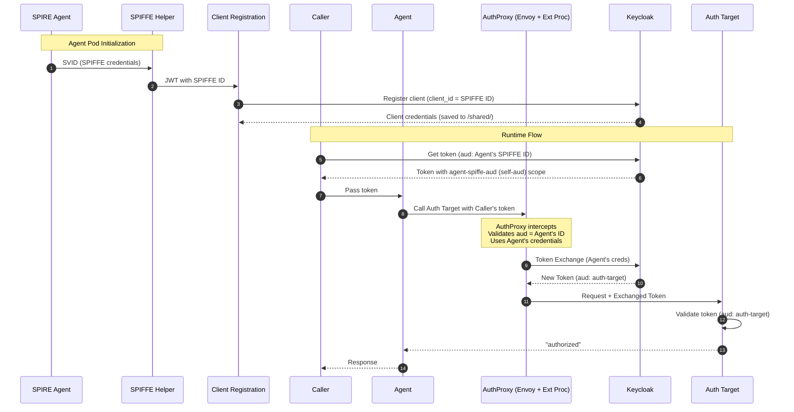
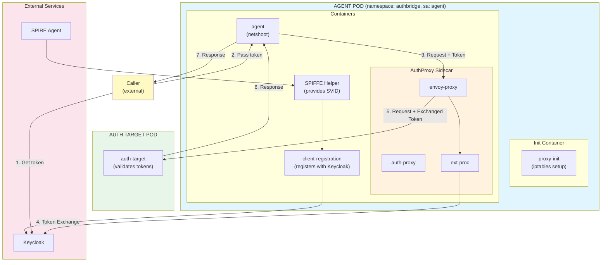

# AuthBridge

AuthBridge provides **secure, transparent token management** for Kubernetes workloads. It combines automatic [client registration](./client-registration/) with [token exchange](./AuthProxy/) capabilities, enabling zero-trust authentication flows with [SPIFFE/SPIRE](https://spiffe.io) integration.

> **📘 Looking to run the demo?** See the [Demo Guide](./demo.md) for step-by-step instructions.

## What AuthBridge Does

AuthBridge solves the challenge of **secure service-to-service authentication** in Kubernetes:

1. **Automatic Identity** - Workloads automatically obtain their identity from SPIFFE/SPIRE and register as Keycloak clients using their SPIFFE ID (e.g., `spiffe://localtest.me/ns/authbridge/sa/agent`)

2. **Token-Based Authorization** - Callers obtain JWT tokens from Keycloak with the target's identity as the audience, authorizing them to invoke specific services

3. **Transparent Token Exchange** - A sidecar intercepts outgoing requests, validates incoming tokens, and exchanges them for tokens with the appropriate target audience—all without application code changes

4. **Target Service Validation** - Target services validate the exchanged token, ensuring it has the correct audience before authorizing requests

## End-to-End Flow

**Initialization (Agent Pod Startup):**
```
  SPIRE Agent              Agent Pod                         Keycloak
       │                        │                                │
       │  0. SVID               │                                │
       │───────────────────────►│  SPIFFE Helper                 │
       │  (SPIFFE ID)           │                                │
       │                        │                                │
       │                        │  1. Register client            │
       │                        │  (client_id = SPIFFE ID)       │
       │                        │───────────────────────────────►│
       │                        │  Client Registration           │
       │                        │                                │
       │                        │◄───────────────────────────────│
       │                        │  client_secret                 │
       │                        │  (saved to /shared/)           │
```

**Runtime Flow:**
```
  Caller              Agent Pod                Auth Target      Keycloak
    │                     │                        │               │
    │  2. Get token       │                        │               │
    │  (aud: Agent's SPIFFE ID)                    │               │
    │─────────────────────────────────────────────────────────────►│
    │◄─────────────────────────────────────────────────────────────│
    │  Token (scope: agent-spiffe-aud)            │               │
    │                     │                        │               │
    │  3. Pass token      │                        │               │
    │  to Agent           │                        │               │
    │────────────────────►│                        │               │
    │                     │                        │               │
    │                     │  4. Agent calls        │               │
    │                     │  Auth Target with      │               │
    │                     │  Caller's token        │               │
    │                     │──────────┐             │               │
    │                     │          │             │               │
    │                     │  AuthProxy intercepts  │               │
    │                     │  validates aud=Agent   │               │
    │                     │          │             │               │
    │                     │  5. Token Exchange     │               │
    │                     │  (using Agent's creds) │               │
    │                     │───────────────────────────────────────►│
    │                     │◄───────────────────────────────────────│
    │                     │  New token (aud: auth-target)          │
    │                     │          │             │               │
    │                     │  6. Forward request    │               │
    │                     │  with exchanged token  │               │
    │                     │───────────────────────►│               │
    │                     │                        │               │
    │                     │◄───────────────────────│               │
    │                     │  "authorized"          │               │
    │◄────────────────────│                        │               │
    │  Response           │                        │               │
```

<details>
<summary><b>📊 Mermaid Diagram (click to expand)</b></summary>



</details>

## What Gets Verified

| Step | Component | Verification |
|------|-----------|--------------|
| 0 | SPIFFE Helper | SVID obtained from SPIRE Agent |
| 1 | Client Registration | Agent registered with Keycloak (client_id = SPIFFE ID) |
| 2 | Caller | Token obtained with `aud: Agent's SPIFFE ID` (via `agent-spiffe-aud` scope) |
| 3 | Agent | Token received from Caller |
| 4 | AuthProxy | Token validated (aud matches Agent's identity) |
| 5 | Ext Proc | Token exchanged using Agent's credentials → `aud: auth-target` |
| 6 | Auth Target | Token validated, returns `"authorized"` |

## Key Security Properties

- **No Static Secrets** - Credentials are dynamically generated during registration
- **Short-Lived Tokens** - JWT tokens expire and must be refreshed
- **Self-Audience Scoping** - Tokens include the Agent's own identity as audience, enabling token exchange
- **Same Identity for Exchange** - AuthProxy uses the Agent's credentials (same SPIFFE ID), matching the token's audience
- **Transparent to Application** - Token exchange is handled by the sidecar; applications don't need to implement it

## Architecture

```
┌────────────────────────────────────────────────────────────────────────┐
│                           AGENT POD                                    │
│                       (namespace: authbridge)                          │
│                      (serviceAccount: agent)                           │
│                                                                        │
│  ┌─────────────────────────────────────────────────────────────────┐   │
│  │  Init Container: proxy-init (iptables setup)                    │   │
│  └─────────────────────────────────────────────────────────────────┘   │
│                                                                        │
│  ┌─────────────────────────────────────────────────────────────────┐   │
│  │                      Containers                                 │   │
│  │  ┌──────────────┐  ┌─────────────────┐  ┌────────────────────┐  │   │
│  │  │    Agent     │  │  SPIFFE Helper  │  │    AuthProxy +     │  │   │
│  │  │  (netshoot)  │  │  (provides      │  │    Envoy + Go Proc │  │   │
│  │  │              │  │   SPIFFE creds) │  │  (token exchange)  │  │   │
│  │  └──────┬───────┘  └─────────────────┘  └──────────┬─────────┘  │   │
│  │                                                                 │   │
│  │  ┌───────────────────────────────────────────────────────────┐  │   │
│  │  │ client-registration (registers Agent with Keycloak)       │  │   │
│  │  └───────────────────────────────────────────────────────────┘  │   │
│  └─────────┼───────────────────────────────────────────┼───────────┘   │
│            │ Caller's token (aud: SPIFFE ID)           │               │
│            └───────────────────────────────────────────┘               │
│                              │                                         │
└──────────────────────────────┼─────────────────────────────────────────┘
                               │ Token exchanged for auth-target audience
                               │ (using Agent's own credentials)
                               ▼
                    ┌─────────────────────┐
                    │   AUTH TARGET POD   │
                    │   (Target Server)   │
                    │                     │
                    │  Validates token    │
                    │  with audience      │
                    │  "auth-target"      │
                    └─────────────────────┘
```

<details>
<summary><b>📊 Mermaid Architecture Diagram (click to expand)</b></summary>



</details>

## Components

### Agent Pod

| Container | Type | Purpose |
|-----------|------|---------|
| `proxy-init` | init | Sets up iptables to intercept outgoing traffic (excludes port 8080 for Keycloak) |
| `client-registration` | container | Registers workload with Keycloak using SPIFFE ID, saves credentials to `/shared/` |
| `agent` (netshoot) | container | The agent application receiving tokens from Callers |
| `spiffe-helper` | container | Provides SPIFFE credentials (SVID) |
| `auth-proxy` | container | Validates tokens |
| `envoy-proxy` | container | Intercepts traffic and performs token exchange via Ext Proc |

### Auth Target Pod

A target service that validates incoming tokens have `aud: auth-target`.

## Prerequisites

- Kubernetes cluster (Kind recommended for local development)
- SPIRE installed and running (server + agent) - for SPIFFE version
- Keycloak deployed
- Docker/Podman for building images

### Quick Setup

The easiest way to get all prerequisites is to use the [Kagenti Ansible installer](https://github.com/kagenti/kagenti/blob/main/docs/install.md#ansible-based-installer-recommended).

## Getting Started

See the **[Demo Guide](./demo.md)** for complete step-by-step instructions on:

- Building and loading images
- Configuring Keycloak
- Deploying the demo
- Testing the token exchange flow
- Inspecting token claims
- Troubleshooting common issues

## Component Documentation

- [AuthProxy](AuthProxy/README.md) - Token validation and exchange proxy
- [Client Registration](client-registration/README.md) - Automatic Keycloak client registration with SPIFFE

## References

- [Kagenti Installation](https://github.com/kagenti/kagenti/blob/main/docs/install.md)
- [SPIRE Documentation](https://spiffe.io/docs/latest/)
- [OAuth 2.0 Token Exchange (RFC 8693)](https://www.rfc-editor.org/rfc/rfc8693)
