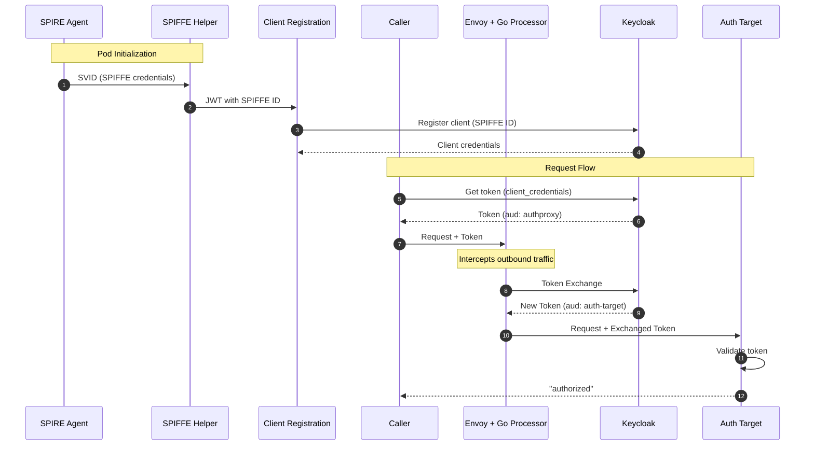
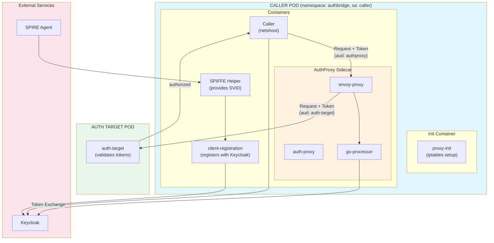

# AuthBridge Demo

This demo combines the [**Client Registration**](./client-registration/) and [**AuthProxy**](./AuthProxy/) components to demonstrate a complete end-to-end authentication flow with [SPIFFE/SPIRE](https://spiffe.io) integration.

## Overview

### What This Demo Demonstrates

The AuthBridge demo showcases a complete **zero-trust authentication flow** for Kubernetes workloads:

1. **Automatic Workload Identity** - A pod automatically obtains its identity from SPIFFE/SPIRE and registers itself as a Keycloak client using its SPIFFE ID (e.g., `spiffe://localtest.me/ns/authbridge/sa/caller`)

2. **Token-Based Authentication** - The caller workload authenticates to Keycloak using `client_credentials` grant and receives a JWT token with audience `authproxy`

3. **Transparent Token Exchange** - When the caller makes a request to the target service, an Envoy sidecar transparently intercepts the request and exchanges the token for one with the correct audience (`auth-target`)

4. **Target Service Validation** - The target service validates the exchanged token, ensuring it has the correct audience before authorizing the request

### End-to-End Flow

```
┌─────────────────────────────────────────────────────────────────────────────────┐
│  1. SPIFFE Helper obtains SVID from SPIRE Agent                                 │
│  2. Client Registration extracts SPIFFE ID and registers with Keycloak          │
│  3. Caller gets token from Keycloak (audience: "authproxy")                     │
│  4. Caller sends request to auth-target with token                              │
│  5. Envoy intercepts request, Go Processor exchanges token (audience: "auth-target")│
│  6. Auth Target validates token and returns "authorized"                         │
└─────────────────────────────────────────────────────────────────────────────────┘

  SPIRE Agent                    Keycloak                      Auth Target
       │                            │                              │
       │  1. SVID                   │                              │
       ▼                            │                              │
  ┌─────────┐                       │                              │
  │ SPIFFE  │  2. Register client   │                              │
  │ Helper  │──────────────────────►│                              │
  └─────────┘                       │                              │
       │                            │                              │
       ▼                            │                              │
  ┌─────────┐  3. Get token         │                              │
  │ Caller  │──────────────────────►│                              │
  │         │◄──────────────────────│                              │
  │         │   (aud: authproxy)    │                              │
  │         │                       │                              │
  │         │  4. Request + token   │                              │
  │         │───────────────────────┼─────────────────────────────►│
  └─────────┘                       │                              │
       │                            │                              │
       │      ┌──────────────┐      │                              │
       └─────►│ Envoy+GoPro  │      │                              │
              │              │  5. Exchange token                  │
              │              │─────►│                              │
              │              │◄─────│                              │
              │              │   (aud: auth-target)                │
              │              │─────────────────────────────────────►│
              └──────────────┘                              6. Validate & Authorize
                                                                   │
                                                            "authorized"
```

<details>
<summary><b>📊 Mermaid Diagram (click to expand)</b></summary>



</details>

### What Gets Verified

| Step | Component | Verification |
|------|-----------|--------------|
| 1 | SPIFFE Helper | SVID obtained from SPIRE Agent |
| 2 | Client Registration | Keycloak client created with SPIFFE ID |
| 3 | Caller | Token received with `aud: authproxy` |
| 4 | Envoy + Go Processor | Token exchanged successfully |
| 5 | Auth Target | Token validated with `aud: auth-target` |
| 6 | End-to-End | Response: `"authorized"` |

### Key Security Properties

- **No Static Secrets** - The caller's client credentials are dynamically generated during registration
- **Short-Lived Tokens** - JWT tokens expire and must be refreshed
- **Audience Scoping** - Tokens are scoped to specific audiences, preventing token reuse across services
- **Transparent to Application** - The caller application doesn't need to know about token exchange; it's handled by the sidecar

## Architecture

```
┌────────────────────────────────────────────────────────────────────────┐
│                           CALLER POD                                   │
│                       (namespace: authbridge)                          │
│                     (serviceAccount: caller)                           │
│                                                                        │
│  ┌─────────────────────────────────────────────────────────────────┐   │
│  │  Init Container: proxy-init (iptables setup)                    │   │
│  └─────────────────────────────────────────────────────────────────┘   │
│                                                                        │
│  ┌─────────────────────────────────────────────────────────────────┐   │
│  │                      Containers                                 │   │
│  │  ┌──────────────┐  ┌─────────────────┐  ┌────────────────────┐  │   │
│  │  │   Caller     │  │  SPIFFE Helper  │  │    AuthProxy +     │  │   │
│  │  │  (netshoot)  │  │  (provides      │  │    Envoy + Go Proc │  │   │
│  │  │              │  │   SPIFFE creds) │  │  (token exchange)  │  │   │
│  │  └──────┬───────┘  └─────────────────┘  └──────────┬─────────┘  │   │
│  │                                                                 │   │
│  │  ┌───────────────────────────────────────────────────────────┐  │   │
│  │  │ client-registration (registers with Keycloak using SPIFFE)│  │   │
│  │  └───────────────────────────────────────────────────────────┘  │   │
│  └─────────┼───────────────────────────────────────────┼───────────┘   │
│            │ HTTP request with token                   │               │
│            └───────────────────────────────────────────┘               │
│                              │                                         │
└──────────────────────────────┼─────────────────────────────────────────┘
                               │ Token exchanged for auth-target audience
                               ▼
                    ┌─────────────────────┐
                    │   AUTH TARGET POD   │
                    │   (Target Server)   │
                    │                     │
                    │  Validates token    │
                    │  with audience      │
                    │  "auth-target"      │
                    └─────────────────────┘
```

<details>
<summary><b>📊 Mermaid Architecture Diagram (click to expand)</b></summary>



</details>

### Token Flow

1. **Client Registration** container uses the **SPIFFE ID** to register the caller workload with Keycloak
2. **Caller** obtains a token from Keycloak using the auto-registered client credentials
3. **AuthProxy + Envoy** (sidecar) intercepts the outgoing request and exchanges the token for one with audience `auth-target`
4. **Auth Target** (target server) validates the exchanged token

### Components in Caller Pod

| Container | Type | Purpose |
|-----------|------|---------|
| `proxy-init` | init | Sets up iptables to intercept outgoing traffic (excludes port 8080 for Keycloak) |
| `client-registration` | container | Registers workload with Keycloak using SPIFFE ID, saves credentials to `/shared/` |
| `caller` (netshoot) | container | The application making requests (has curl and jq) |
| `spiffe-helper` | container | Provides SPIFFE credentials (SVID) |
| `auth-proxy` | container | Validates tokens |
| `envoy-proxy` | container | Intercepts traffic and performs token exchange via go-processor |

## Prerequisites

- Kubernetes cluster (Kind recommended for local development)
- SPIRE installed and running (server + agent) - for SPIFFE version
- Keycloak deployed
- Docker/Podman for building images

### Quick Setup with Kagenti

The easiest way to get all prerequisites is to use the [Kagenti Ansible installer](https://github.com/kagenti/kagenti/blob/main/docs/install.md#ansible-based-installer-recommended).

## End-to-End Testing Guide

### Step 1: Build and Load AuthProxy Images

```bash
cd AuthBridge/AuthProxy

# Build all images
make build-images

# Load images into Kind cluster
make load-images
```

### Step 2: Configure Keycloak

Port-forward Keycloak to access it locally:

```bash
kubectl port-forward service/keycloak-service -n keycloak 8080:8080
```

In a new terminal, run the setup script:

```bash
cd AuthBridge

# Create virtual environment
python -m venv venv
source venv/bin/activate

# Install dependencies
pip install --upgrade pip
pip install -r requirements.txt

# Run setup script
python setup_keycloak.py
```

The script creates:
- `demo` realm
- `authproxy` client (for token exchange)
- `auth-target` client (token exchange target audience)
- `authproxy-aud` scope (realm default - all clients get it)
- `auth-target-aud` scope (for exchanged tokens)

**Important:** Copy the `authproxy` client secret from the output.

### Step 3: Deploy the Demo

```bash
cd AuthBridge

# With SPIFFE (requires SPIRE)
kubectl apply -f k8s/authbridge-deployment.yaml

# OR without SPIFFE
kubectl apply -f k8s/authbridge-deployment-no-spiffe.yaml
```

This creates:

- `authbridge` namespace
- `caller` ServiceAccount
- ConfigMaps and Secrets
- `caller` and `auth-target` deployments

### Step 4: Update the Secret

```bash
kubectl apply -f k8s/auth-proxy-config.yaml 

# IMPORTANT: Update with the actual authproxy client secret from Step 2
# Copy the secret value from the setup_keycloak.py output
kubectl patch secret auth-proxy-config -n authbridge -p '{"stringData":{"CLIENT_SECRET":"YOUR_AUTHPROXY_SECRET_HERE"}}'

# Verify it was updated (should NOT show REPLACE_WITH_AUTHPROXY_SECRET)
kubectl get secret auth-proxy-config -n authbridge -o jsonpath='{.data.CLIENT_SECRET}' | base64 -d && echo

# Restart the caller pod to pick up the new secret
kubectl delete pod -l app=caller -n authbridge
```

### Step 5: Configure Image Pull Secret (if needed)

If using Kagenti, copy the ghcr secret:

```bash
kubectl get secret ghcr-secret -n team1 -o yaml | sed 's/namespace: team1/namespace: authbridge/' | kubectl apply -f -
```

### Step 6: Wait for Deployments

```bash
kubectl wait --for=condition=available --timeout=180s deployment/caller -n authbridge
kubectl wait --for=condition=available --timeout=120s deployment/auth-target -n authbridge
```

### Step 7: Test the Flow

```bash
# Exec into the caller container
kubectl exec -it deployment/caller -n authbridge -c caller -- sh
```

Inside the container (or run as a single command):

```bash
# Credentials are auto-populated by client-registration
CLIENT_ID=$(cat /shared/client-id.txt)
CLIENT_SECRET=$(cat /shared/client-secret.txt)

echo "Client ID: $CLIENT_ID"
echo "Client Secret: $CLIENT_SECRET"

# Get a token from Keycloak
TOKEN=$(curl -sX POST http://keycloak-service.keycloak.svc:8080/realms/demo/protocol/openid-connect/token \
  -d 'grant_type=client_credentials' \
  -d "client_id=$CLIENT_ID" \
  -d "client_secret=$CLIENT_SECRET" | jq -r '.access_token')

echo "Token obtained!"

# Verify token audience (should be "authproxy")
echo $TOKEN | cut -d'.' -f2 | base64 -d 2>/dev/null | jq '{aud, azp, scope}'

# Call auth-target (AuthProxy will exchange token for "auth-target" audience)
curl -H "Authorization: Bearer $TOKEN" http://auth-target-service:8081/test

# Expected output: "authorized"
```

**Or run the complete test as a single command:**

```bash
kubectl exec deployment/caller -n authbridge -c caller -- sh -c '
CLIENT_ID=$(cat /shared/client-id.txt)
CLIENT_SECRET=$(cat /shared/client-secret.txt)
TOKEN=$(curl -s http://keycloak-service.keycloak.svc:8080/realms/demo/protocol/openid-connect/token \
  -d "grant_type=client_credentials" -d "client_id=$CLIENT_ID" -d "client_secret=$CLIENT_SECRET" | jq -r ".access_token")
echo "Token audience: $(echo $TOKEN | cut -d. -f2 | base64 -d 2>/dev/null | jq -r .aud)"
echo "Result: $(curl -s -H "Authorization: Bearer $TOKEN" http://auth-target-service:8081/test)"
'
```

### Step 8: Inspect Token Claims (Before and After Exchange)

This step shows how the token claims change during the exchange process.

#### View Original Token Claims (Before Exchange)

From inside the caller container, inspect the token obtained from Keycloak:

```bash
# Get the token
CLIENT_ID=$(cat /shared/client-id.txt)
CLIENT_SECRET=$(cat /shared/client-secret.txt)
TOKEN=$(curl -sX POST http://keycloak-service.keycloak.svc:8080/realms/demo/protocol/openid-connect/token \
  -d 'grant_type=client_credentials' \
  -d "client_id=$CLIENT_ID" \
  -d "client_secret=$CLIENT_SECRET" | jq -r '.access_token')

# Decode and display important claims
echo "=== ORIGINAL TOKEN (Before Exchange) ==="
echo $TOKEN | cut -d'.' -f2 | base64 -d 2>/dev/null | jq '{
  aud: .aud,
  azp: .azp,
  scope: .scope,
  iss: .iss,
  sub: .sub,
  exp: .exp,
  iat: .iat
}'
```

**Expected output:**
```json
{
  "aud": "authproxy",
  "azp": "spiffe://localtest.me/ns/authbridge/sa/caller",
  "scope": "profile authproxy-aud email",
  "iss": "http://keycloak.localtest.me:8080/realms/demo",
  "sub": "...",
  "exp": 1234567890,
  "iat": 1234567890
}
```

Key observations:
- `aud: "authproxy"` - Token is scoped for AuthProxy
- `azp` - The SPIFFE ID of the caller (authorized party)
- `scope` - Includes `authproxy-aud` scope

#### View Exchanged Token Claims (After Exchange)

To see the token after exchange, check the auth-target logs which display the received token:

```bash
kubectl logs deployment/auth-target -n authbridge | grep -A 20 "JWT Debug"
```

**Expected output:**
```shell
[JWT Debug] Successfully validated token
[JWT Debug] Audience: [auth-target]
[JWT Debug] Subject: ...
```

#### Complete Token Comparison Script

Run this from the caller container to see both tokens side-by-side:

```bash
kubectl exec deployment/caller -n authbridge -c caller -- sh -c '
CLIENT_ID=$(cat /shared/client-id.txt)
CLIENT_SECRET=$(cat /shared/client-secret.txt)

# Get original token
TOKEN=$(curl -s http://keycloak-service.keycloak.svc:8080/realms/demo/protocol/openid-connect/token \
  -d "grant_type=client_credentials" \
  -d "client_id=$CLIENT_ID" \
  -d "client_secret=$CLIENT_SECRET" | jq -r ".access_token")

echo "╔══════════════════════════════════════════════════════════════╗"
echo "║           ORIGINAL TOKEN (Before Exchange)                   ║"
echo "╚══════════════════════════════════════════════════════════════╝"
echo $TOKEN | cut -d"." -f2 | base64 -d 2>/dev/null | jq "{aud, azp, scope}"

echo ""
echo "╔══════════════════════════════════════════════════════════════╗"
echo "║  Calling auth-target... (token exchange happens here)       ║"
echo "╚══════════════════════════════════════════════════════════════╝"
RESULT=$(curl -s -H "Authorization: Bearer $TOKEN" http://auth-target-service:8081/test)
echo "Result: $RESULT"

echo ""
echo "╔══════════════════════════════════════════════════════════════╗"
echo "║  Check auth-target logs for EXCHANGED token claims          ║"
echo "╚══════════════════════════════════════════════════════════════╝"
echo "Run: kubectl logs deployment/auth-target -n authbridge | tail -20"
'
```

#### Token Claims Summary

| Claim | Before Exchange | After Exchange |
|-------|-----------------|----------------|
| `aud` | `authproxy` | `auth-target` |
| `azp` | SPIFFE ID (caller) | `authproxy` |
| `scope` | `authproxy-aud` | `auth-target-aud` |
| `iss` | Keycloak realm | Keycloak realm (same) |

The key change is the **audience (`aud`)** - it transforms from `authproxy` to `auth-target`, allowing the target service to validate the token.

## Verification

### Check Client Registration

```bash
kubectl logs deployment/caller -n authbridge -c client-registration
```

You should see:

```shell
SPIFFE credentials ready!
Client ID (SPIFFE ID): spiffe://...
Created Keycloak client "spiffe://..."
Client registration complete!
```

### Check Token Exchange

```bash
kubectl logs deployment/caller -n authbridge -c envoy-proxy 2>&1 | grep -i "token"
```

You should see:

```shell
[Token Exchange] All required headers present, attempting token exchange
[Token Exchange] Successfully exchanged token
[Token Exchange] Replacing token in Authorization header
```

### Check Auth Target

```bash
kubectl logs deployment/auth-target -n authbridge
```

You should see:

```shell
[JWT Debug] Successfully validated token
[JWT Debug] Audience: [auth-target]
Authorized request: GET /test
```

## Troubleshooting

### Client Registration Can't Reach Keycloak

**Symptom:** `Connection refused` when connecting to Keycloak

**Fix:** Ensure `OUTBOUND_PORTS_EXCLUDE: "8080"` is set in proxy-init env vars. This excludes Keycloak port from iptables redirect.

### Token Exchange Fails with "Audience not found"

**Symptom:** `{"error":"invalid_client","error_description":"Audience not found"}`

**Fix:** The `auth-target` client must exist in Keycloak. Run `setup_keycloak.py` which creates it.

### Token Exchange Fails with "Client not enabled to retrieve service account"

**Symptom:** `{"error":"unauthorized_client","error_description":"Client not enabled to retrieve service account"}`

**Fix:** The caller's client needs `serviceAccountsEnabled: true`. This is set in the updated `client_registration.py`.

### curl/jq Not Found in Caller Container

**Symptom:** `sh: curl: not found` or `sh: jq: not found`

**Fix:** The caller container should use `nicolaka/netshoot:latest` image which has these tools pre-installed.

### No Token Received

**Symptom:** `echo $TOKEN=null`

**Fix:** Make sure the `serviceAccountsEnabled` is present in the `client-registration` image.

#### Enable Service Accounts for the Registered Client

The published `client-registration` image doesn't yet have the `serviceAccountsEnabled` fix. Run this to enable it:

```bash
kubectl exec deployment/caller -n authbridge -c caller -- sh -c '
CLIENT_ID=$(cat /shared/client-id.txt)
echo "Enabling service accounts for: $CLIENT_ID"

ADMIN_TOKEN=$(curl -s http://keycloak-service.keycloak.svc:8080/realms/master/protocol/openid-connect/token \
  -d "grant_type=password" -d "client_id=admin-cli" -d "username=admin" -d "password=admin" | jq -r ".access_token")

INTERNAL_ID=$(curl -s -H "Authorization: Bearer $ADMIN_TOKEN" \
  "http://keycloak-service.keycloak.svc:8080/admin/realms/demo/clients?clientId=$CLIENT_ID" | jq -r ".[0].id")

curl -s -X PUT -H "Authorization: Bearer $ADMIN_TOKEN" -H "Content-Type: application/json" \
  "http://keycloak-service.keycloak.svc:8080/admin/realms/demo/clients/$INTERNAL_ID" \
  -d "{\"clientId\": \"$CLIENT_ID\", \"serviceAccountsEnabled\": true}"

echo "Done!"
'
```

### View All Logs

```bash
# Caller pod containers
kubectl logs deployment/caller -n authbridge -c caller
kubectl logs deployment/caller -n authbridge -c client-registration
kubectl logs deployment/caller -n authbridge -c spiffe-helper
kubectl logs deployment/caller -n authbridge -c auth-proxy
kubectl logs deployment/caller -n authbridge -c envoy-proxy

# Auth Target
kubectl logs deployment/auth-target -n authbridge
```

## Cleanup

```bash
kubectl delete -f k8s/authbridge-deployment.yaml
# OR
kubectl delete -f k8s/authbridge-deployment-no-spiffe.yaml

# Delete the namespace (removes everything)
kubectl delete namespace authbridge
```

## Component Documentation

- [AuthProxy](AuthProxy/README.md) - Token validation and exchange proxy
- [Client Registration](client-registration/README.md) - Automatic Keycloak client registration with SPIFFE

## References

- [Kagenti Installation](https://github.com/kagenti/kagenti/blob/main/docs/install.md)
- [SPIRE Documentation](https://spiffe.io/docs/latest/)
