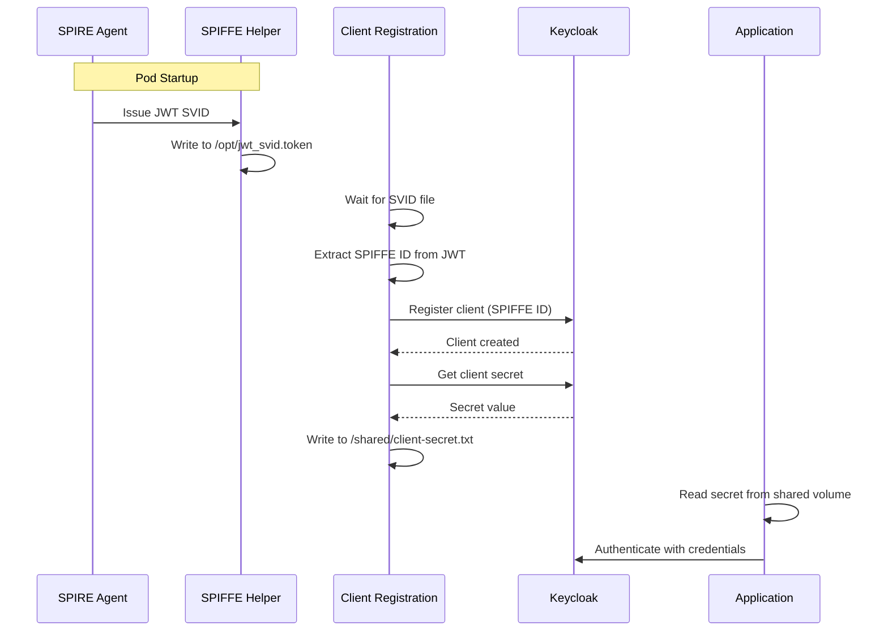

# Client Registration

Client Registration is an **automated OAuth2/OIDC client provisioning** tool for Kubernetes workloads. It automatically registers pods as Keycloak clients, eliminating the need for manual client configuration and static credentials.

## What Client Registration Does

Client Registration solves a common challenge in Kubernetes environments: **how can workloads authenticate to OAuth2/OIDC providers without pre-provisioned static credentials?**

### The Problem

Traditional OAuth2 authentication requires:
1. Pre-creating clients in Keycloak for each service
2. Generating and distributing client secrets
3. Managing secret rotation manually
4. Tracking which client belongs to which workload

```
┌─────────────────┐         ┌─────────────────┐
│   Admin         │         │    Keycloak     │
│                 │─────────│                 │
│ 1. Create client│  Manual │ Client: svc-a   │
│ 2. Copy secret  │ Process │ Secret: xxx     │
│ 3. Create K8s   │         │                 │
│    secret       │         │                 │
└─────────────────┘         └─────────────────┘
        │
        ▼ Manual secret distribution
┌─────────────────┐
│   Workload Pod  │
│   (uses secret) │
└─────────────────┘
```

### The Solution

Client Registration automates this entire process:

```
┌─────────────────────────────────────────────────────────────────────┐
│                         POD                                         │
│  ┌─────────────────┐    ┌─────────────────┐    ┌─────────────────┐  │
│  │  SPIFFE Helper  │───►│ Client          │───►│   Application   │  │
│  │  (gets SVID)    │    │ Registration    │    │   (uses secret) │  │
│  └─────────────────┘    └────────┬────────┘    └─────────────────┘  │
│                                  │                                   │
└──────────────────────────────────┼───────────────────────────────────┘
                                   │
                    ┌──────────────▼──────────────┐
                    │         Keycloak            │
                    │                             │
                    │  1. Register client         │
                    │     (using SPIFFE ID)       │
                    │  2. Generate secret         │
                    │  3. Return credentials      │
                    └─────────────────────────────┘
```

**Benefits:**
- **Zero manual configuration** - Clients are created automatically at pod startup
- **Cryptographic identity** - Uses SPIFFE ID as client identifier (unique, verifiable)
- **Dynamic secrets** - Each pod instance gets its own credentials
- **Self-service** - No admin intervention needed for new workloads

## How It Works

### With SPIFFE/SPIRE (Recommended)

When SPIRE is enabled, the client registration uses the pod's **SPIFFE ID** as the Keycloak client ID:

```
SPIFFE ID: spiffe://localtest.me/ns/authbridge/sa/caller
                    └──────────┘ └─────────┘ └──────┘
                    Trust Domain  Namespace   Service Account
```

1. **SPIFFE Helper** obtains a JWT SVID from the SPIRE Agent
2. **Client Registration** extracts the SPIFFE ID from the JWT's `sub` claim
3. **Client Registration** creates a Keycloak client with:
   - `clientId`: The SPIFFE ID (e.g., `spiffe://localtest.me/ns/authbridge/sa/caller`)
   - `name`: The friendly name from `CLIENT_NAME` env var
4. **Client Registration** retrieves the generated client secret
5. **Client Registration** writes the secret to a shared volume for the application to use

### Without SPIFFE

When SPIRE is not available, the client registration uses a static client name:

1. **Client Registration** uses the `CLIENT_NAME` environment variable as both client ID and name
2. The rest of the flow is the same

## Architecture



## Configuration

### Environment Variables

| Variable | Required | Description | Example |
|----------|----------|-------------|---------|
| `SPIRE_ENABLED` | No | Enable SPIFFE ID extraction (default: `false`) | `true` |
| `CLIENT_NAME` | Yes | Friendly name for the client | `my-service` |
| `KEYCLOAK_URL` | Yes | Keycloak server URL | `http://keycloak:8080` |
| `KEYCLOAK_REALM` | Yes | Keycloak realm name | `demo` |
| `KEYCLOAK_ADMIN_USERNAME` | Yes | Admin username | `admin` |
| `KEYCLOAK_ADMIN_PASSWORD` | Yes | Admin password | `admin` |
| `KEYCLOAK_TOKEN_EXCHANGE_ENABLED` | No | Enable token exchange for client (default: `true`) | `true` |
| `KEYCLOAK_CLIENT_REGISTRATION_ENABLED` | No | Enable/disable registration (default: `true`) | `true` |
| `SECRET_FILE_PATH` | No | Path to write client secret (default: `/shared/secret.txt`) | `/shared/client-secret.txt` |

### Created Client Configuration

The registered Keycloak client is configured with:

| Setting | Value | Description |
|---------|-------|-------------|
| `clientId` | SPIFFE ID or CLIENT_NAME | Unique client identifier |
| `name` | CLIENT_NAME | Human-readable name |
| `publicClient` | `false` | Client authentication enabled (confidential client) |
| `serviceAccountsEnabled` | `true` | Allows `client_credentials` grant |
| `standardFlowEnabled` | `true` | Allows authorization code flow |
| `directAccessGrantsEnabled` | `true` | Allows password grant |
| `standard.token.exchange.enabled` | `true` | Allows token exchange |

## Quick Start

### Prerequisites

- Kubernetes cluster
- Keycloak deployed and accessible
- (Optional) SPIRE installed for SPIFFE support

### Usage with SPIFFE/SPIRE

1. **Ensure SPIRE is installed** (see [SPIRE Installation](#install-spire))

2. **Deploy your workload with client-registration:**

```yaml
apiVersion: apps/v1
kind: Deployment
metadata:
  name: my-app
spec:
  template:
    spec:
      serviceAccountName: my-service-account
      containers:
        # Your application
        - name: my-app
          image: my-app:latest
          volumeMounts:
            - name: shared-data
              mountPath: /shared
        
        # SPIFFE Helper - obtains SVID from SPIRE
        - name: spiffe-helper
          image: ghcr.io/spiffe/spiffe-helper:nightly
          command: ["/spiffe-helper", "-config=/etc/spiffe-helper/helper.conf", "run"]
          volumeMounts:
            - name: spiffe-helper-config
              mountPath: /etc/spiffe-helper
            - name: spire-agent-socket
              mountPath: /spiffe-workload-api
            - name: svid-output
              mountPath: /opt
        
        # Client Registration - registers with Keycloak
        - name: client-registration
          image: ghcr.io/kagenti/kagenti-extensions/client-registration:latest
          command:
            - /bin/sh
            - -c
            - |
              while [ ! -f /opt/jwt_svid.token ]; do sleep 1; done
              python client_registration.py
              tail -f /dev/null
          env:
            - name: SPIRE_ENABLED
              value: "true"
            - name: CLIENT_NAME
              value: "my-app"
            - name: KEYCLOAK_URL
              value: "http://keycloak-service.keycloak.svc:8080"
            - name: KEYCLOAK_REALM
              value: "demo"
            - name: KEYCLOAK_ADMIN_USERNAME
              value: "admin"
            - name: KEYCLOAK_ADMIN_PASSWORD
              value: "admin"
            - name: SECRET_FILE_PATH
              value: "/shared/client-secret.txt"
          volumeMounts:
            - name: shared-data
              mountPath: /shared
            - name: svid-output
              mountPath: /opt
      
      volumes:
        - name: shared-data
          emptyDir: {}
        - name: svid-output
          emptyDir: {}
        - name: spire-agent-socket
          hostPath:
            path: /run/spire/agent-sockets
        - name: spiffe-helper-config
          configMap:
            name: spiffe-helper-config
```

3. **Verify registration:**

```bash
# Check client-registration logs
kubectl logs deployment/my-app -c client-registration

# Expected output:
# Created Keycloak client "spiffe://localtest.me/ns/default/sa/my-service-account": <uuid>
# Successfully retrieved secret for client "my-app".
# Secret written to file: "/shared/client-secret.txt"
# Client registration complete.
```

4. **Use the credentials in your application:**

```bash
# From inside your application container
CLIENT_SECRET=$(cat /shared/client-secret.txt)
CLIENT_ID="spiffe://localtest.me/ns/default/sa/my-service-account"

# Get a token from Keycloak
curl -X POST http://keycloak:8080/realms/demo/protocol/openid-connect/token \
  -d "grant_type=client_credentials" \
  -d "client_id=$CLIENT_ID" \
  -d "client_secret=$CLIENT_SECRET"
```

### Usage without SPIFFE

For environments without SPIRE, use a static client name:

```yaml
- name: client-registration
  image: ghcr.io/kagenti/kagenti-extensions/client-registration:latest
  command: ["python", "client_registration.py"]
  env:
    - name: SPIRE_ENABLED
      value: "false"
    - name: CLIENT_NAME
      value: "my-app"  # Used as both client ID and name
    # ... other env vars
```

## Installation

### Install SPIRE

If using SPIFFE, install SPIRE first:

```bash
# Install SPIRE CRDs
helm upgrade --install spire-crds spire-crds \
  -n spire-mgmt \
  --repo https://spiffe.github.io/helm-charts-hardened/ \
  --create-namespace --wait

# Install SPIRE (Server + Agent)
helm upgrade --install spire spire \
  -n spire-mgmt \
  --repo https://spiffe.github.io/helm-charts-hardened/ \
  -f https://raw.githubusercontent.com/kagenti/kagenti/main/kagenti/installer/app/resources/spire-helm-values.yaml
```

### Install Keycloak

```bash
# Create namespace
kubectl apply -f "https://raw.githubusercontent.com/kagenti/kagenti/refs/heads/main/kagenti/installer/app/resources/keycloak-namespace.yaml"

# Deploy Keycloak with Postgres
kubectl apply -f "https://raw.githubusercontent.com/kagenti/kagenti/refs/heads/main/kagenti/installer/app/resources/keycloak.yaml" -n keycloak

# Wait for Keycloak to be ready
kubectl rollout status statefulset/keycloak -n keycloak --timeout=120s

# Port forward to access Keycloak UI
kubectl port-forward service/keycloak-service -n keycloak 8080:8080
```

Access Keycloak at http://keycloak.localtest.me:8080 (admin/admin)

## Example Deployments

### With SPIFFE

```bash
kubectl apply -f example_deployment_spiffe.yaml
```

Creates:
- Namespace `my-agent`
- ServiceAccount `my-service-account`
- Deployment with SPIFFE Helper and Client Registration

**Verify in Keycloak:**
Navigate to Clients and confirm a new client with SPIFFE ID:


### Without SPIFFE

```bash
kubectl apply -f example_deployment.yaml
```

**Verify in Keycloak:**
Navigate to Clients and confirm a new client with static name:


## Troubleshooting

### Client Registration Fails to Connect to Keycloak

**Symptom:** `Connection refused` or timeout errors

**Fix:** Ensure the pod can reach Keycloak. If using AuthProxy with iptables, exclude Keycloak's port:
```yaml
env:
  - name: OUTBOUND_PORTS_EXCLUDE
    value: "8080"
```

### "Client not enabled to retrieve service account"

**Symptom:** Token request fails with this error

**Fix:** The client needs `serviceAccountsEnabled: true`. This is set by default in the latest version. For existing clients, enable it manually in Keycloak or delete and re-register.

### SVID File Not Found

**Symptom:** `Error: The file /opt/jwt_svid.token was not found`

**Fix:** Ensure SPIFFE Helper is running and has access to the SPIRE Agent socket. Check:
```bash
kubectl logs deployment/my-app -c spiffe-helper
```

## Related Documentation

- [AuthBridge Demo](../README.md) - Complete end-to-end demo
- [AuthProxy](../AuthProxy/README.md) - Token validation and exchange
- [SPIFFE/SPIRE Documentation](https://spiffe.io/docs/latest/)
- [Keycloak Client Registration](https://www.keycloak.org/docs/latest/securing_apps/#_client_registration)
