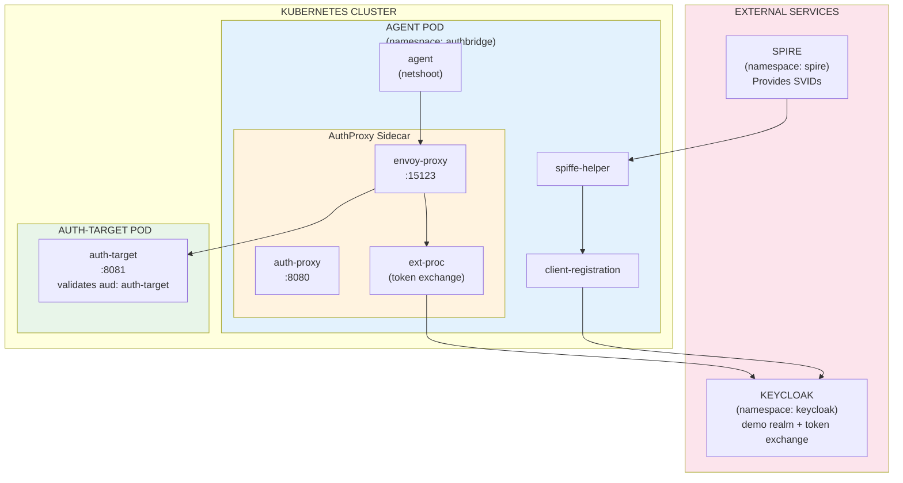
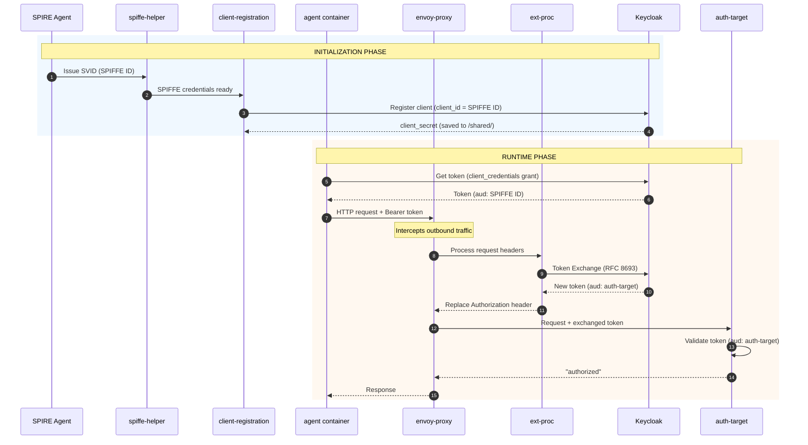

# AuthBridge Demo Guide

This guide provides step-by-step instructions for running the AuthBridge demo.

> **📘 New to AuthBridge?** See the [README](./README.md) for an overview of what AuthBridge does and how it works.

## Demo Components

The demo deploys the following components:

```
┌─────────────────────────────────────────────────────────────────────────────┐
│                              KUBERNETES CLUSTER                              │
│                                                                              │
│  ┌─────────────────────────────────────────────────────────────────────┐    │
│  │                    AGENT POD (namespace: authbridge)                 │    │
│  │                                                                      │    │
│  │  ┌─────────────┐  ┌─────────────┐  ┌──────────────────────────────┐ │    │
│  │  │    agent    │  │   spiffe-   │  │      client-registration     │ │    │
│  │  │ (netshoot)  │  │   helper    │  │  (registers with Keycloak)   │ │    │
│  │  └─────────────┘  └─────────────┘  └──────────────────────────────┘ │    │
│  │                                                                      │    │
│  │  ┌───────────────────────────────────────────────────────────────┐  │    │
│  │  │                    AuthProxy Sidecar                           │  │    │
│  │  │  ┌────────────┐  ┌──────────────┐  ┌────────────────────────┐ │  │    │
│  │  │  │ auth-proxy │  │ envoy-proxy  │  │       ext-proc         │ │  │    │
│  │  │  │  (8080)    │  │   (15123)    │  │  (token exchange)      │ │  │    │
│  │  │  └────────────┘  └──────────────┘  └────────────────────────┘ │  │    │
│  │  └───────────────────────────────────────────────────────────────┘  │    │
│  └─────────────────────────────────────────────────────────────────────┘    │
│                                      │                                       │
│                                      ▼                                       │
│  ┌─────────────────────────────────────────────────────────────────────┐    │
│  │                 AUTH-TARGET POD (namespace: authbridge)              │    │
│  │                                                                      │    │
│  │  ┌─────────────────────────────────────────────────────────────┐    │    │
│  │  │                      auth-target (8081)                      │    │    │
│  │  │               Validates tokens with aud: auth-target         │    │    │
│  │  └─────────────────────────────────────────────────────────────┘    │    │
│  └─────────────────────────────────────────────────────────────────────┘    │
│                                                                              │
├──────────────────────────────────────────────────────────────────────────────┤
│                            EXTERNAL SERVICES                                 │
│                                                                              │
│  ┌──────────────────────┐          ┌──────────────────────┐                 │
│  │   SPIRE (namespace:  │          │ KEYCLOAK (namespace: │                 │
│  │       spire)         │          │     keycloak)        │                 │
│  │                      │          │                      │                 │
│  │  Provides SPIFFE     │          │  - demo realm        │                 │
│  │  identities (SVIDs)  │          │  - token exchange    │                 │
│  └──────────────────────┘          └──────────────────────┘                 │
└─────────────────────────────────────────────────────────────────────────────┘
```

<details>
<summary><b>📊 Mermaid Component Diagram (click to expand)</b></summary>



</details>

## Demo Flow

The following diagram shows the complete token flow from initialization through request handling:

```
┌──────────────────────────────────────────────────────────────────────────────┐
│                           INITIALIZATION PHASE                                │
└──────────────────────────────────────────────────────────────────────────────┘

  SPIRE Agent           Agent Pod                              Keycloak
       │                    │                                      │
       │ 1. Issue SVID      │                                      │
       │ ──────────────────►│ spiffe-helper                        │
       │   (SPIFFE ID)      │                                      │
       │                    │                                      │
       │                    │ 2. Register client                   │
       │                    │    (client_id = SPIFFE ID)           │
       │                    │ ────────────────────────────────────►│
       │                    │    client-registration               │
       │                    │                                      │
       │                    │◄─────────────────────────────────────│
       │                    │    client_secret                     │
       │                    │    (saved to /shared/)               │

┌──────────────────────────────────────────────────────────────────────────────┐
│                            RUNTIME PHASE                                      │
└──────────────────────────────────────────────────────────────────────────────┘

  Agent Container        AuthProxy Sidecar          Auth-Target      Keycloak
       │                        │                        │               │
       │ 3. Get token           │                        │               │
       │    (client_credentials)│                        │               │
       │────────────────────────┼────────────────────────┼──────────────►│
       │◄───────────────────────┼────────────────────────┼───────────────│
       │    Token: aud=SPIFFE ID│                        │               │
       │                        │                        │               │
       │ 4. Call auth-target    │                        │               │
       │    with token          │                        │               │
       │───────────────────────►│                        │               │
       │                        │                        │               │
       │                   ┌────┴────┐                   │               │
       │                   │ Envoy   │                   │               │
       │                   │intercepts                   │               │
       │                   └────┬────┘                   │               │
       │                        │                        │               │
       │                        │ 5. Token Exchange      │               │
       │                        │    (ext-proc)          │               │
       │                        │───────────────────────────────────────►│
       │                        │◄───────────────────────────────────────│
       │                        │    New token: aud=auth-target          │
       │                        │                        │               │
       │                        │ 6. Forward request     │               │
       │                        │    with new token      │               │
       │                        │───────────────────────►│               │
       │                        │                        │               │
       │                        │◄───────────────────────│               │
       │                        │    "authorized"        │               │
       │◄───────────────────────│                        │               │
       │    Response            │                        │               │
```

<details>
<summary><b>📊 Mermaid Sequence Diagram (click to expand)</b></summary>



</details>

### Key Points

| Phase | Step | Description |
|-------|------|-------------|
| **Init** | 1 | SPIRE issues SVID with SPIFFE ID to the pod |
| **Init** | 2 | client-registration registers with Keycloak using SPIFFE ID as client_id |
| **Runtime** | 3 | Agent gets token from Keycloak (aud = own SPIFFE ID) |
| **Runtime** | 4 | Agent calls auth-target; Envoy intercepts |
| **Runtime** | 5 | ext-proc exchanges token for new audience (auth-target) |
| **Runtime** | 6 | Request forwarded with exchanged token; auth-target validates and responds |

---

## End-to-End Testing Guide

### Step 1: Build and Load AuthProxy Images

*Note: This step will be replaced by the CI pipeline. The images will be auto-created*

```bash
cd AuthBridge/AuthProxy

# Build all images
make build-images

# Load images into Kind cluster
make load-images
```

### Step 2: Configure Keycloak

Assuming Keycloak is running as a part of the Kagenti install, port-forward Keycloak to access it locally:

```bash
kubectl port-forward service/keycloak-service -n keycloak 8080:8080
```

In a new terminal, run the setup script:

```bash
cd AuthBridge

# Create virtual environment
python -m venv venv
source venv/bin/activate

# Install dependencies
pip install --upgrade pip
pip install -r requirements.txt

# Run setup script
python setup_keycloak.py
```

The `setup_keycloak` script creates:

- `demo` realm
- `auth-target` client (token exchange target audience)
- `agent-spiffe-aud` scope (realm default - adds Agent's SPIFFE ID to all tokens)
- `auth-target-aud` scope (for exchanged tokens)

**Note:** No static `agent` client is created - the AuthProxy uses the dynamically
registered client credentials from `/shared/` (populated by client-registration).

### Step 3: Configure GitHub Image Pull Secret (if needed)

If using Kagenti, copy the ghcr secret:

```bash
kubectl get secret ghcr-secret -n team1 -o yaml | sed 's/namespace: team1/namespace: authbridge/' | kubectl apply -f -
```

### Step 4: Deploy the Demo

```bash
cd AuthBridge

# With SPIFFE (requires SPIRE)
kubectl apply -f k8s/authbridge-deployment.yaml
```

OR without SPIFFE:

```bash
kubectl apply -f k8s/authbridge-deployment-no-spiffe.yaml
```

This creates:

- `authbridge` namespace
- `agent` ServiceAccount
- ConfigMaps and Secrets (including `auth-proxy-config`)
- `agent` and `auth-target` deployments

### Step 5: Wait for Deployments

```bash
kubectl wait --for=condition=available --timeout=180s deployment/agent -n authbridge
kubectl wait --for=condition=available --timeout=120s deployment/auth-target -n authbridge
```

### Step 6: Test the Flow

```bash
# Exec into the agent container
kubectl exec -it deployment/agent -n authbridge -c agent -- sh
```

Inside the container (or run as a single command):

```bash
# Credentials are auto-populated by client-registration
CLIENT_ID=$(cat /shared/client-id.txt)
CLIENT_SECRET=$(cat /shared/client-secret.txt)

echo "Client ID: $CLIENT_ID"
echo "Client Secret: $CLIENT_SECRET"

# Get a token from Keycloak
TOKEN=$(curl -sX POST http://keycloak-service.keycloak.svc:8080/realms/demo/protocol/openid-connect/token \
  -d 'grant_type=client_credentials' \
  -d "client_id=$CLIENT_ID" \
  -d "client_secret=$CLIENT_SECRET" | jq -r '.access_token')

echo "Token obtained!"

# Verify token audience (should be Agent's SPIFFE ID via agent-spiffe-aud scope)
echo $TOKEN | cut -d'.' -f2 | tr '_-' '/+' | { read p; echo "${p}=="; } | base64 -d | jq '{aud, azp, scope, iss}'

# Call auth-target (AuthProxy will exchange token for "auth-target" audience)
curl -H "Authorization: Bearer $TOKEN" http://auth-target-service:8081/test

# Expected output: "authorized"
```

**Or run the complete test as a single command:**

```bash
kubectl exec deployment/agent -n authbridge -c agent -- sh -c '
CLIENT_ID=$(cat /shared/client-id.txt)
CLIENT_SECRET=$(cat /shared/client-secret.txt)
TOKEN=$(curl -s http://keycloak-service.keycloak.svc:8080/realms/demo/protocol/openid-connect/token \
  -d "grant_type=client_credentials" -d "client_id=$CLIENT_ID" -d "client_secret=$CLIENT_SECRET" | jq -r ".access_token")
echo "Token audience: $(echo $TOKEN | cut -d. -f2 | tr '_-' '/+' | { read p; echo "${p}=="; } | base64 -d | jq -r .aud)"
echo "Result: $(curl -s -H "Authorization: Bearer $TOKEN" http://auth-target-service:8081/test)"
'
```

### Step 7: Inspect Token Claims (Before and After Exchange)

This step shows how the token claims change during the exchange process.

#### View Original Token Claims (Before Exchange)

From inside the agent container, inspect the token obtained from Keycloak:

```bash
# Get the token
CLIENT_ID=$(cat /shared/client-id.txt)
CLIENT_SECRET=$(cat /shared/client-secret.txt)
TOKEN=$(curl -sX POST http://keycloak-service.keycloak.svc:8080/realms/demo/protocol/openid-connect/token \
  -d 'grant_type=client_credentials' \
  -d "client_id=$CLIENT_ID" \
  -d "client_secret=$CLIENT_SECRET" | jq -r '.access_token')

# Decode and display important claims
echo "=== ORIGINAL TOKEN (Before Exchange) ==="
echo $TOKEN | cut -d'.' -f2 | tr '_-' '/+' | { read p; echo "${p}=="; } | base64 -d  | jq '{
  aud: .aud,
  azp: .azp,
  scope: .scope,
  iss: .iss,
  sub: .sub,
  exp: .exp,
  iat: .iat
}'
```

**Expected output:**
```json
{
  "aud": "spiffe://localtest.me/ns/authbridge/sa/agent",
  "azp": "spiffe://localtest.me/ns/authbridge/sa/agent",
  "scope": "agent-spiffe-aud profile email",
  "iss": "http://keycloak.localtest.me:8080/realms/demo",
  "sub": "3fe8b589-aefa-4377-b735-3c5110ec3ec2",
  "exp": 1767756190,
  "iat": 1767755890
}
```

Key observations:
- `aud: spiffe://...` - The Agent's SPIFFE ID as audience, authorizes the AuthProxy to exchange this token
- `azp` - The SPIFFE ID of the caller (same as audience since Agent is calling for itself)
- `scope: agent-spiffe-aud` - The realm default scope that adds the Agent's SPIFFE ID to audience
- **Security model** - The SPIFFE ID in the audience matches the credentials in `/shared/`

#### View Exchanged Token Claims (After Exchange)

To see the token after exchange, check the auth-target logs which display the received token:

```bash
kubectl logs deployment/auth-target -n authbridge | grep -A 20 "JWT Debug"
```

**Expected output:**
```shell
[JWT Debug] Successfully validated token
[JWT Debug] Audience: [auth-target]
[JWT Debug] Subject: ...
```

#### Complete Token Comparison Script

Run this to see both tokens side-by-side:

```bash
kubectl exec deployment/agent -n authbridge -c agent -- sh -c '
CLIENT_ID=$(cat /shared/client-id.txt)
CLIENT_SECRET=$(cat /shared/client-secret.txt)

# Get original token
TOKEN=$(curl -s http://keycloak-service.keycloak.svc:8080/realms/demo/protocol/openid-connect/token \
  -d "grant_type=client_credentials" \
  -d "client_id=$CLIENT_ID" \
  -d "client_secret=$CLIENT_SECRET" | jq -r ".access_token")

echo "╔══════════════════════════════════════════════════════════════╗"
echo "║           ORIGINAL TOKEN (Before Exchange)                   ║"
echo "╚══════════════════════════════════════════════════════════════╝"
echo $TOKEN | cut -d'.' -f2 | tr '_-' '/+' | { read p; echo "${p}=="; } | base64 -d | jq "{aud, azp, scope, iss}"

echo ""
echo "╔══════════════════════════════════════════════════════════════╗"
echo "║  Calling auth-target... (token exchange happens here)        ║"
echo "╚══════════════════════════════════════════════════════════════╝"
RESULT=$(curl -s -H "Authorization: Bearer $TOKEN" http://auth-target-service:8081/test)
echo "Result: $RESULT"

echo ""
echo "╔══════════════════════════════════════════════════════════════╗"
echo "║  Check auth-target logs for EXCHANGED token claims           ║"
echo "╚══════════════════════════════════════════════════════════════╝"
echo "Run: kubectl logs deployment/auth-target -n authbridge | tail -20"
'
kubectl logs deployment/auth-target -n authbridge | tail -20
```

#### Token Claims Summary

| Claim | Before Exchange | After Exchange |
|-------|-----------------|----------------|
| `aud` | Agent's SPIFFE ID | `auth-target` |
| `azp` | SPIFFE ID (caller) | Agent's SPIFFE ID |
| `scope` | `agent-spiffe-aud profile email` | `auth-target-aud` |
| `iss` | Keycloak realm | Keycloak realm (same) |

The key changes during token exchange:
- **`aud`** transforms from Agent's SPIFFE ID to `auth-target`, allowing the target service to validate the token
- **`azp`** changes to the Agent's SPIFFE ID, indicating the proxy (using its own credentials) performed the exchange

**Security Model Benefits:**
- The `agent-spiffe-aud` scope adds the Agent's SPIFFE ID to all tokens' audience
- The AuthProxy uses the same credentials as the registered client (matching the token's audience)
- No static secrets - credentials are dynamically generated by client-registration
- Clear audit trail - you can see which client (SPIFFE ID) exchanged the token via the `azp` claim
- Token exchange logic is handled by the sidecar, transparent to the application code

## Verification

### Check Client Registration

```bash
kubectl logs deployment/agent -n authbridge -c client-registration
```

You should see:

```shell
SPIFFE credentials ready!
Client ID (SPIFFE ID): spiffe://...
Created Keycloak client "spiffe://..."
Client registration complete!
```

### Check Token Exchange

```bash
kubectl logs deployment/agent -n authbridge -c envoy-proxy 2>&1 | grep -i "token"
```

You should see:

```shell
[Token Exchange] All required headers present, attempting token exchange
[Token Exchange] Successfully exchanged token
[Token Exchange] Replacing token in Authorization header
```

### Check Auth Target

```bash
kubectl logs deployment/auth-target -n authbridge
```

You should see:

```shell
[JWT Debug] Successfully validated token
[JWT Debug] Audience: [auth-target]
Authorized request: GET /test
```

## Troubleshooting

### Client Registration Can't Reach Keycloak

**Symptom:** `Connection refused` when connecting to Keycloak

**Fix:** Ensure `OUTBOUND_PORTS_EXCLUDE: "8080"` is set in proxy-init env vars. This excludes Keycloak port from iptables redirect.

### Token Exchange Fails with "Audience not found"

**Symptom:** `{"error":"invalid_client","error_description":"Audience not found"}`

**Fix:** The `auth-target` client must exist in Keycloak. Run `setup_keycloak.py` which creates it.

### Token Exchange Fails with "Client is not within the token audience"

**Symptom:** Token exchange fails with error:
```
{"error":"access_denied","error_description":"Client is not within the token audience"}
```

**Cause:** The caller's token doesn't include the Agent's SPIFFE ID in its audience. Keycloak requires the exchanging client to be in the token's audience for security reasons.

**Fix:** Add the `agent-spiffe-aud` scope to the caller client:

```bash
kubectl exec deployment/agent -n authbridge -c agent -- sh -c '
ADMIN_TOKEN=$(curl -s http://keycloak-service.keycloak.svc:8080/realms/master/protocol/openid-connect/token \
  -d "grant_type=password" -d "client_id=admin-cli" -d "username=admin" -d "password=admin" | jq -r ".access_token")

SCOPE_ID=$(curl -s -H "Authorization: Bearer $ADMIN_TOKEN" \
  "http://keycloak-service.keycloak.svc:8080/admin/realms/demo/client-scopes" | \
  jq -r ".[] | select(.name==\"agent-spiffe-aud\") | .id")

CLIENT_ID=$(cat /shared/client-id.txt)
INTERNAL_ID=$(curl -s -H "Authorization: Bearer $ADMIN_TOKEN" \
  "http://keycloak-service.keycloak.svc:8080/admin/realms/demo/clients?clientId=$CLIENT_ID" | jq -r ".[0].id")

curl -s -X PUT -H "Authorization: Bearer $ADMIN_TOKEN" \
  "http://keycloak-service.keycloak.svc:8080/admin/realms/demo/clients/$INTERNAL_ID/default-client-scopes/$SCOPE_ID"

echo "Added agent-spiffe-aud scope to $CLIENT_ID"
'
```

**Note:** This is a security feature, not a limitation. The `agent-spiffe-aud` scope adds the Agent's SPIFFE ID to the token's audience, authorizing the AuthProxy (using the same credentials) to exchange tokens.

### Token Exchange Fails with "Client not enabled to retrieve service account"

**Symptom:** `{"error":"unauthorized_client","error_description":"Client not enabled to retrieve service account"}`

**Fix:** The caller's client needs `serviceAccountsEnabled: true`. This is set in the updated `client_registration.py`.

### curl/jq Not Found in Agent Container

**Symptom:** `sh: curl: not found` or `sh: jq: not found`

**Fix:** The agent container should use `nicolaka/netshoot:latest` image which has these tools pre-installed.

### No Token Received

**Symptom:** `echo $TOKEN=null`

**Fix:** Make sure the `serviceAccountsEnabled` is present in the `client-registration` image.

#### Enable Service Accounts for the Registered Client

The published `client-registration` image doesn't yet have the `serviceAccountsEnabled` fix. Run this to enable it:

```bash
kubectl exec deployment/agent -n authbridge -c agent -- sh -c '
CLIENT_ID=$(cat /shared/client-id.txt)
echo "Enabling service accounts for: $CLIENT_ID"

ADMIN_TOKEN=$(curl -s http://keycloak-service.keycloak.svc:8080/realms/master/protocol/openid-connect/token \
  -d "grant_type=password" -d "client_id=admin-cli" -d "username=admin" -d "password=admin" | jq -r ".access_token")

INTERNAL_ID=$(curl -s -H "Authorization: Bearer $ADMIN_TOKEN" \
  "http://keycloak-service.keycloak.svc:8080/admin/realms/demo/clients?clientId=$CLIENT_ID" | jq -r ".[0].id")

curl -s -X PUT -H "Authorization: Bearer $ADMIN_TOKEN" -H "Content-Type: application/json" \
  "http://keycloak-service.keycloak.svc:8080/admin/realms/demo/clients/$INTERNAL_ID" \
  -d "{\"clientId\": \"$CLIENT_ID\", \"serviceAccountsEnabled\": true}"

echo "Done!"
'
```

### View All Logs

```bash
# Agent pod containers
kubectl logs deployment/agent -n authbridge -c agent
kubectl logs deployment/agent -n authbridge -c client-registration
kubectl logs deployment/agent -n authbridge -c spiffe-helper
kubectl logs deployment/agent -n authbridge -c auth-proxy
kubectl logs deployment/agent -n authbridge -c envoy-proxy

# Auth Target
kubectl logs deployment/auth-target -n authbridge
```

## Cleanup

```bash
kubectl delete -f k8s/authbridge-deployment.yaml
# OR
kubectl delete -f k8s/authbridge-deployment-no-spiffe.yaml

# Delete the namespace (removes everything)
kubectl delete namespace authbridge
```

## Next Steps

- See [AuthProxy Documentation](AuthProxy/README.md) for details on token validation and exchange
- See [Client Registration Documentation](client-registration/README.md) for details on automatic Keycloak registration
- See [README](./README.md) for architecture overview
