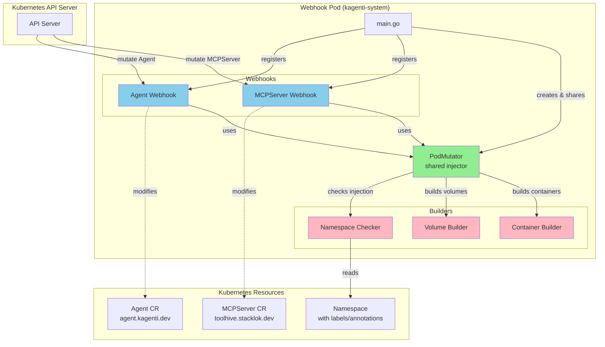

# Kagenti Webhook Architecture

This document provides Mermaid diagram illustrating the webhook architecture.

## Component Architecture

```mermaid
graph TB
    subgraph "Kubernetes API Server"
        API[API Server]
    end

    subgraph "Webhook Pod (kagenti-system)"
        MAIN[main.go]
        MUTATOR[PodMutator<br/>shared injector]

        subgraph "Webhooks"
            MCP[MCPServer Webhook]
            AGENT[Agent Webhook]
        end

        subgraph "Builders"
            CONT[Container Builder]
            VOL[Volume Builder]
            NS[Namespace Checker]
        end
    end

    subgraph "Kubernetes Resources"
        MCPCR[MCPServer CR<br/>toolhive.stacklok.dev]
        AGENTCR[Agent CR<br/>agent.kagenti.dev]
        NAMESPACE[Namespace<br/>with labels/annotations]
    end

    API -->|mutate MCPServer| MCP
    API -->|mutate Agent| AGENT

    MAIN -->|creates & shares| MUTATOR
    MAIN -->|registers| MCP
    MAIN -->|registers| AGENT

    MCP -->|uses| MUTATOR
    AGENT -->|uses| MUTATOR

    MUTATOR -->|builds containers| CONT
    MUTATOR -->|builds volumes| VOL
    MUTATOR -->|checks injection| NS

    NS -->|reads| NAMESPACE
    MCP -.->|modifies| MCPCR
    AGENT -.->|modifies| AGENTCR

    style MUTATOR fill:#90EE90
    style MCP fill:#87CEEB
    style AGENT fill:#87CEEB
    style CONT fill:#FFB6C1
    style VOL fill:#FFB6C1
    style NS fill:#FFB6C1
```
